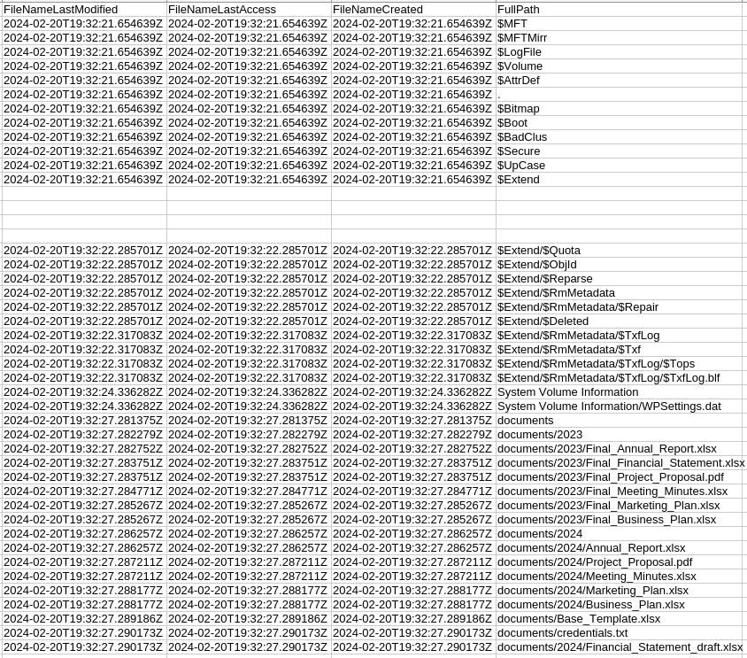

# HTB Cyber Apocalypse 2024: Hacker Royale - Pursue The Tracks

## Challenge

> Luxx, leader of The Phreaks, immerses himself in the depths of his computer, tirelessly pursuing the secrets of a file he obtained accessing an opposing faction member workstation. With unwavering determination, he scours through data, putting together fragments of information trying to take some advantage on other factions. To get the flag, you need to answer the questions from the docker instance.

## Metadata

- Difficulty: easy
- Creator: `Nauten`
- Files: [`z.mft`](files/z.mft)
- Docker: yes
- Tags: `mft`, `ntfs`, `timestamps`, `timeline`, `q&a`
- Points: `300`
- Number of solvers: 

## Solution

We get an MFT file which is ([microsoft.com](https://learn.microsoft.com/en-us/windows/win32/fileio/master-file-table)):

> The NTFS file system contains a file called the master file table, or MFT. There is at least one entry in the MFT for every file on an NTFS file system volume, including the MFT itself. All information about a file, including its size, time and date stamps, permissions, and data content, is stored either in MFT entries, or in space outside the MFT that is described by MFT entries.

We can use the following MFT parser the get the contents in CSV: https://github.com/omerbenamram/mft

```bash
mft_dump -o csv z.mft
```

Now with the CSV file ([`mft.csv`](files/mft.csv)), we can start to answer the questions on the remote server.

Check the size for this
```
A file was also copied, which is the new filename? (for example: randomname.pdf)
> Financial_Statement_draft.xlsx
[+] Correct!
```

### Question 1

```
Files are related to two years, which are those? (for example: 1993,1995)
```
There are two directories under the `documents` folder, `2023` and `2024`.



```
> 2023,2024
[+] Correct!
```

### Question 2

```
There are some documents, which is the name of the first file written? (for example: randomname.pdf)
```
We can check the `FileNameCreated` or the `StandardInforCreated` columns:
```
> Final_Annual_Report.xlsx
[+] Correct!
```

### Question 3

```
Which file was deleted? (for example: randomname.pdf)
```
We can check the `IsDeleted` column:
```
> Marketing_Plan.xlsx
[+] Correct!
```

### Question 4

```
How many of them have been set in Hidden mode? (for example: 43)
```
We can check the `StandardInfoFlags` column and search for the `FILE_ATTRIBUTE_HIDDEN` attribute excluding the `FILE_ATTRIBUTE_SYSTEM` ones.
```
> 1
[+] Correct!
```

### Question 5

```
Which is the filename of the important TXT file that was created? (for example: randomname.txt)
```
There is only one TXT file: `documents/credentials.txt`
```
> credentials.txt
[+] Correct!
```

### Question 6

```
A file was also copied, which is the new filename? (for example: randomname.pdf)
```
We can check the `FileSize` column and the columns containing timestamps. The `Base_Template.xlsx` was copied and the new filename is:
```
> Financial_Statement_draft.xlsx
[+] Correct!
```

### Question 7

```
Which file was modified after creation? (for example: randomname.pdf)
```
We can check the differences between the `*LastModified` and the `*Created` columns:
```
> Project_Proposal.pdf
[+] Correct!
```

### Question 8

```
What is the name of the file located at record number 45? (for example: randomname.pdf)
```
We can check the `EntryId` column:
```
> Annual_Report.xlsx
[+] Correct!
```

### Question 9

```
What is the size of the file located at record number 40? (for example: 1337)
```
We can check the `EntryId` and `FileSize` columns:
```
> 57344
[+] Correct!
```

### The Flag

After the final successful answer, we get the flag:

```
[+] Here is the flag: HTB{p4rs1ng_mft_1s_v3ry_1mp0rt4nt_s0m3t1m3s}
```

Flag: `HTB{p4rs1ng_mft_1s_v3ry_1mp0rt4nt_s0m3t1m3s}`