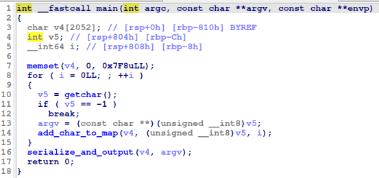
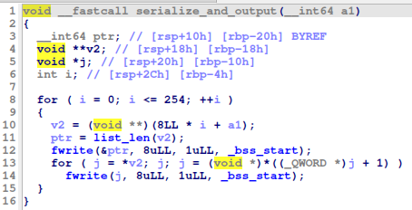

# HTB Cyber Apocalypse 2024: Hacker Royale - Crushing

## Challenge

> You managed to intercept a message between two event organizers. Unfortunately, it's been compressed with their proprietary message transfer format. Luckily, they're gamemakers first and programmers second - can you break their encoding?

## Metadata

- Difficulty: easy
- Creator: `clubby789`
- Files: [`crush`](files/crush), [`message.txt.cz`](files/message.txt.cz)
- Docker: no
- Tags: `elf`, `serialization`, `deserialization`
- Points: `300`
- Number of solvers: 

## Solution

- We've got an ELF executable ([`crush`](files/crush))
- The `main` function initializes a 256 entry long array which is an array of pointers
- Then it reads characters from `stdin` until `EOF` and calls `add_char_to_map` with each character, which stores the characters somehow
- If there are no more characters it calls the `serialize_and_output` function






- Our task is to recover the input of the program from its output (the serialized data, [`message.txt.cz`](files/message.txt.cz))
- The storage works the following way:
    - For each character (byte) it stores the positions they appearad in in a linked-list (one-way)
    - the 0x00. index of the 255 size array stores a pointer to the linked list of the positions of the `0x00` byte
    - the 0x61. index of the 255 size array stores a pointer to the linked list of the positions of the `0x61` byte (the `a` character)
    - etc.
- The serialization works the following way:
    - It iterates from byte 0x00 to byte 0xff
    - Prints the number of occurrances of the current character (8 bytes long)
    - Then prints the positions (occurrances) of the current character (8 bytes long)
    - Basically it is a serialization of multiple linked lists

Let's deserialize a bit manually for example

```
00000000  00 00 00 00 00 00 00 00  00 00 00 00 00 00 00 00  |................|
*
00000050  0c 00 00 00 00 00 00 00  49 00 00 00 00 00 00 00  |........I.......|
00000060  4a 00 00 00 00 00 00 00  8e 00 00 00 00 00 00 00  |J...............|
00000070  8f 00 00 00 00 00 00 00  19 01 00 00 00 00 00 00  |................|
00000080  1a 01 00 00 00 00 00 00  b3 01 00 00 00 00 00 00  |................|
00000090  b4 01 00 00 00 00 00 00  2f 02 00 00 00 00 00 00  |......../.......|
000000a0  30 02 00 00 00 00 00 00  bd 02 00 00 00 00 00 00  |0...............|
000000b0  be 02 00 00 00 00 00 00  00 00 00 00 00 00 00 00  |................|
000000c0  00 00 00 00 00 00 00 00  00 00 00 00 00 00 00 00  |................|
*
00000160  79 00 00 00 00 00 00 00  09 00 00 00 00 00 00 00  |y...............|
00000170  0c 00 00 00 00 00 00 00  11 00 00 00 00 00 00 00  |................|
```

- The first non-zero byte is at `0x50` which is `0x0c`
- This means that `0x50/8 == '\n'` occurred `0x0c == 12` times in the input
- The first occurrance is at offset `0x49`, the second is t offset `0x4a`, then `0x8e`, `0x8f`, `0x0119` ...
- The next character is at `0x160` which is `0x160/8 == ','` `0x79` times and the first occurrance is at offset `0x09`
- But for example if there are consecutive bytes (e.g.: `0x61` and `0x62`) present in the input, the serialized output will look like something similar:
    - Number of occurrances of `0x61`
    - Positions of `0x61`
    - And immediatelly after it the number of occurrances of `0x62`
    - Positions of `0x61`
- This means that the number of occurrances of each byte will not be found at offset `bytevalue`*8, but far later

We can write a Python snippet to deserialize the serialized data ([`solve.py](files/solve.py)).

```python
dump = open('message.txt.cz', 'rb').read()
entries = []
length = 0

for i in range(0, len(dump), 8):
    value = int.from_bytes(dump[i:i+8], "little")
    entries.append(value)
    if value > length:
        length = value

text = ['*'] * (length+1)

size = 0
character = 0
i = 0
while i < len(entries):
    if i == 0:
        while i == 0:
            i += 1
        size = entries[i]
        character = i
        for j in range(i+1, i+1+size):
            text[entries[j]] = chr(character)
    else:
        size = entries[i]
        character = character + 1
        for j in range(i+1, i+1+size):
            text[entries[j]] = chr(character)
    i = i + 1 + size
print(''.join(text))
```

```
$ python solve.py
Organizer 1: Hey, did you finalize the password for the next... you know?

Organizer 2: Yeah, I did. It's "HTB{4_v3ry_b4d_compr3ss1on_sch3m3}"

Organizer 1: "HTB{4_v3ry_b4d_compr3ss1on_sch3m3}," got it. Sounds ominous enough to keep things interesting. Where do we spread the word?

Organizer 2: Let's stick to the usual channels: encrypted messages to the leaders and discreetly slip it into the training manuals for the participants.

Organizer 1: Perfect. And let's make sure it's not leaked this time. Last thing we need is an early bird getting the worm.

Organizer 2: Agreed. We can't afford any slip-ups, especially with the stakes so high. The anticipation leading up to it should be palpable.

Organizer 1: Absolutely. The thrill of the unknown is what keeps them coming back for more. "HTB{4_v3ry_b4d_compr3ss1on_sch3m3}" it is then.
```

Flag: `HTB{4_v3ry_b4d_compr3ss1on_sch3m3}`