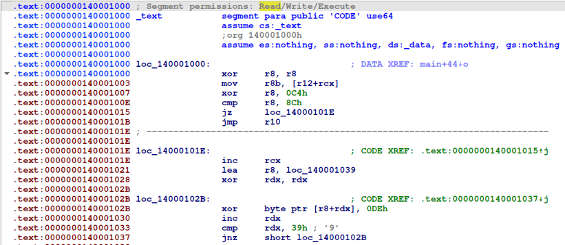

# HTB Cyber Apocalypse 2024: Hacker Royale - FollowThePath

## Challenge

> A dark tunnel has been placed in the arena. Within it is a powerful cache of weapons, but reaching them won't be easy. You must navigate the depths, barely able to see the ground beyond your feet...

## Metadata

- Difficulty: medium
- Creator: `es3n1n`
- Files: [`chall.exe`](files/chall.exe)
- Docker: no
- Tags: `exe`, `shellcode`, `self-decryption`
- Points: `300`
- Number of solvers: 

## Solution

- We've got a Windows executable, which seems as a crackme challenge, because if we start it it prints `Please enter the flag`
- I used both `Ghidra` and `IDA` because `IDA` could idenfity the `main` function and `Ghidra` could decompile the first stage code at `0x140001000`
- The main function starts at `0x140001960`


- It prints `Please enter the flag` and reads our input string
- At the end of the function it jumps to `0x140001000`





- Then it checks the first character of the input (`chr(0x8c ^ 0xc4) == 'H'`)
- From here there are many `0x39` size consecutive blocks, each block
    - Checks the next character of the flag / input
        - Gets the character
        - XORs with a hardcoded byte which is different in all other blocks
        - Checks the result with another hardcoded byte which is also different in all other blocks
    - If the check is successful, it decrypts the next 0x39 size block
        - Gets a hardcoded byte which is different in all other blocks
        - XORs the next block byte by byte
        - Executes next block
- We can write the decryption for each step using the bytes, without disassembling the bytes
    - We can extract the necessary bytes based on their offset
    - The relevant XOR keys are at a fix offset in each block, because all blocks do the same

```python
shellcode = bytes.fromhex("93EF1E9B54DAD2975F2E8BDEDEDE975F26DFDEDEDED15ADDDEDEDE9F213C96211F9253DBCFDEDEDE96EF0C9F5EEACE3596211C965D24E7AB2CA6DA2BAE61EFE7A26A1BF0EBEBEBA26A13B2EBEBEBE46FE8EBEBEBAA1409A3142AA766EEFAEBEBEBA3DA39AA6BDFFB89A31429A36811D29E192F53A227E8666E2BE392F76262622BE39A8C6262626DE661626262239D802A9DA32EEF67736262622A53B023E25672F62A9DA02AE1985B1790D9A554D11E9098DD156441949494DD156C329494949B1097949494D56B76DC6B55D8199185949494DCA546D514A084A2DC6B56DC176EADE1667B07F673BC323A7FB7C63F3636367FB7CE0C36363639B23536363677C9D47EC9F77ABB33273636367E07E477B60226FF7EC9F47EB5CC0F43C484F8098C43CDC5804839C5C9C9C9804831A9C9C9C9C64DCAC9C9C988362B8136088544CCD8C9C9C981F81B8849FDD95C81360B814A33F0BC3BD8A455D01F9199DC1465A9959595DC146DEF9595959A1196959595D46A77DD6A54D9189084959595DDA447D415A18589DD6A57DD166FACE067512DDC59961810559DECDB1C1C1C559DE4841C1C1C13981F1C1C1C5DE3FE54E3DD5091190D1C1C1C542DCE5D9C280C4F54E3DE549FE62569EE1E629316D9575F1AD2A3485353531AD2AB2C5353535CD75053535312ACB11BAC921FDE56425353531B628112D36743F51BAC911BD0A96A26A1EB9766E32CA2AAEF2756ADA6A6A6EF275E9EA6A6A6A922A5A6A6A6E75944EE5967EA2BA3B7A6A6A6EE9774E72692B6A5EE5964EE255C9FD3544E32C34689070F4A82F3FB0303034A82FBB80303030C870003030342FCE14BFCC24F8E06120303034B32D142833713E04BFCC14B80F93A76F1AED223A669E7EFAA621328E3E3E3AA621B7AE3E3E3EC67E0E3E3E3A21C01AB1C22AF6EE6F2E3E3E3ABD231A263D7F31CAB1C21AB6019DA9611B2CE3FBA75FBF3B67E0F20FFFFFFB67E0779FFFFFFF07BFCFFFFFFBE001DB7003EB372FAEEFFFFFFB7CE2DBE7FCBEF37B7003DB77C05C68A0D85F9088D42CCC4814938E0C8C8C881493090C8C8C8C74CCBC8C8C889372A8037098445CDD9C8C8C880F91A8948FCD84880370A804B32F1BD3ACDB140C50A848CC9017091808080C90178E58080808F0483808080C17F62C87F41CC0D8591808080C8B152C100B49030C87F42C8037AB9F572FD8170F53AB4BCF931403CB0B0B0F931480DB0B0B0BF34B3B0B0B0F14F52F84F71FC3DB5A1B0B0B0F88162F13084A08EF84F72F8334A89C542730FFE7BB43A3277BFCEBE3E3E3E77BFC68E3E3E3E31BA3D3E3E3E7FC1DC76C1FF72B33B2F3E3E3E760FEC7FBE0A2E3276C1FC76BDC4074BCC413DCC49860800458DFCB30C0C0C458DF4FD0C0C0C03880F0C0C0C4DF3EE44F3CD4081091D0C0C0C443DDE4D8C381CD944F3CE448FF63579FE98E415905FD1D99C54257BD5D5D59C542D56D5D5D5DA51D6D5D5D5942A379D2A149958D0C4D5D5D59DE4079455E1C5D99D2A179D562FECA027413DCC49860800458DFCF50C0C0C458DF4C40C0C0C03880F0C0C0C4DF3EE44F3CD4081091D0C0C0C443DDE4D8C381C7944F3CE448FF63579FE3844B530FF71793CF485537575753CF48D207575757AF176757575348A973D8AB439F870647575753D44A734F54165C53D8AB73DF68F4C0087FD8170F53AB4BCF9314025B0B0B0F931487AB0B0B0BF34B3B0B0B0F14F52F84F71FC3DB5A1B0B0B0F88162F13084A093F84F72F8334A89C5426E12E366A9272F6AA2D3CA2323236AA2DBA12323232CA72023232362DCC16BDCE26FAE26322323236B12F162A31733F86BDCE16BA0D91A56D196EA1B9E51DFD7925A2B4CDBDBDB925A237DDBDBDBD45FD8DBDBDB9A243993241A9756DECADBDBDB93EA099A5BEFCB0C932419935821E2AE299AE617925DD3DB9E5627B7D7D7D79E562FD9D7D7D7D853D4D7D7D79628359F28169B5AD2C6D7D7D79FE6059657E3C7169F28159F542DEEA2258CF001844BC5CD8840315CC1C1C188403938C1C1C1CE45C2C1C1C1803E23893E008D4CC4D0C1C1C189F0138041F5D159893E0389423BF8B433D5A958DD129C94D119681F989898D119602B989898971C9B989898D9677AD06759D4159D89989898D0A94AD918AC888FD0675AD01B62A1ED6A5A26D7529D131B5E96E7451717175E96EF1A17171718931417171756E8F55FE8D65B9A12061717175F26C5569723079C5FE8D55F94ED2E62E5C6BA4BCE018F87C20A7B6E8B8B8BC20A730D8B8B8B840F888B8B8BCA7469C3744AC7068E9A8B8B8BC3BA59CA0BBF9B1EC37449C30871B2FE79D8A455D01F9199DC1465C6959595DC146DF69595959A1196959595D46A77DD6A54D9189084959595DDA447D415A185B7DD6A57DD166FACE0676F13E267A8262E6BA3D20C2222226BA3DA3C2222222DA62122222263DDC06ADDE36EAF27332222226A13F063A21632836ADDE06AA1D81B57D0EC9061E42BA5ADE8205157A1A1A1E820593BA1A1A1AE25A2A1A1A1E05E43E95E60ED2CA4B0A1A1A1E99073E02195B153E95E63E9225B98D453BFC332B778F6FEBB7302F6F2F2F2BB730AA9F2F2F2FD76F1F2F2F2B30D10BA0D33BE7FF7E3F2F2F2BAC320B372C6E2CEBA0D30BA7108CB8700710DFC79B6383075BDCC443C3C3C75BDC42D3C3C3C33B83F3C3C3C7DC3DE74C3FD70B1392D3C3C3C740DEE7DBC082C7A74C3FE74BFC60549CE0B778603CC424A0FC7B6644646460FC7BE5146464649C24546464607B9A40EB9870ACB43574646460E779407C67256940EB9840EC5BC7F33B49FE3129758D6DE9B532257D2D2D29B532A39D2D2D2DD56D1D2D2D2932D309A2D139E5FD7C3D2D2D29AE3009352E6C2DD9A2D109A5128EBA720423ECF4A850B03468EFF310F0F0F468EF7450F0F0F008B0C0F0F0F4EF0ED47F0CE43820A1E0F0F0F473EDD4E8F3B1F0947F0CD478CF5367AFD4B37C6438C020A4F87F6090606064F87FE5606060609820506060647F9E44EF9C74A8B03170606064E37D4478632165D4EF9C44E85FC3F73F4166A9B1ED15F5712DAAB165B5B5B12DAA3275B5B5B54DF585B5B5B1AA4B913A49A17D65E4A5B5B5B136A891ADB6F4B8213A49913D8A1622EA994E8199C53DDD5905829DDD9D9D9905821A9D9D9D9D65DDAD9D9D998263B9126189554DCC8D9D9D991E80B9859EDC91D91261B915A23E0AC2B89F504814EC0C88D45340CC4C4C48D453C71C4C4C4CB40C7C4C4C4853B268C3B058849C1D5C4C4C48CF5168544F0D4168C3B068C473EFDB136932D31CCCCCC")

key = 0xde
length = 0x39
flag = 'H'

for i in range(len(shellcode) // 0x39):
    next_stage = b''
    for j in range(length):
        next_stage += int.to_bytes(shellcode[i*0x39 + j] ^ key)

    flag += chr(next_stage[10]^next_stage[17])
    print(flag)
    key = next_stage[-10]
```

Flag : `HTB{s3lF_d3CRYpt10N-1s_k1nd4_c00l_i5nt_1t}`