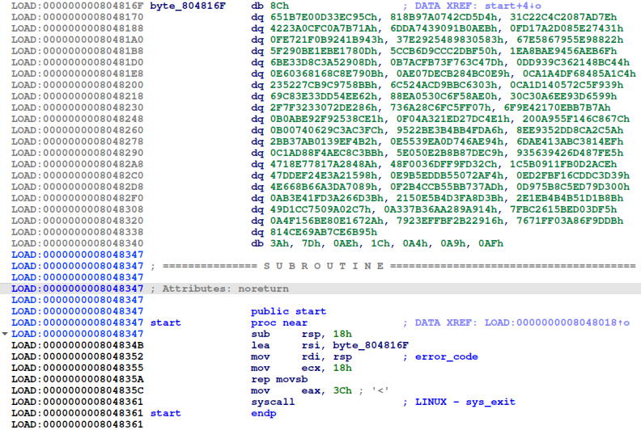
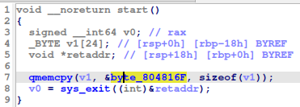
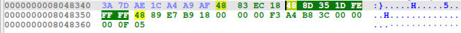

# HTB Cyber Apocalypse 2024: Hacker Royale - QuickScan

## Challenge

> In order to escape this alive, you must carefully observe and analyze your opponents. Learn every strategy and technique in their arsenal, and you stand a chance of outwitting them. Just do it fast, before they do the same to you...

## Metadata

- Difficulty: medium
- Creator: `clubby789`
- Files: -
- Docker: yes
- Tags: `ELF`, `automatic static analysis`
- Points: `300`
- Number of solvers: 

## Solution

If we connect to the remote we get the following messages:

```
I am about to send you 128 base64-encoded ELF files, which load a value onto the stack. You must send back the loaded value as a hex string
You must analyze them all in under 120 seconds
Let's start with a warmup
ELF:  f0VMRgIBAQAAAAAAAAAAAAIAPgABAAAAeIAECAAAAABAAAAAAAAAAAAAAAAAAAAAAAAAAEAAOAABAAAAAAAAAAEAAAAFAAAAAAAAAAAAAAAAgAQIAAAAAACABAgAAAAAwQMAAAAAAADBAwAAAAAAAAAQAAAAAAAASIPsGEiNNfwCAABIiee5GAAAAPOkuDwAAAAPBYV1Vc9DIviUmFgQRLmnNqQ5VMubkNF3fvEkZ2hVFc0GIrdQZ9JErA40Z/x19UMrAx/4Od38LIL8IiNoodruaBSmI2E2nF3X3iiuHJv3c4WvKnb1svcO8qXTXdALN0wsLibXlAxSC+cy3hDUDMxtQanywH4aguCFHKBCR06DOTQ6qv4hrkUX8CaHJGH/kVM9cE6lILrnkUmRzpdfOKBUY+heZS3z5nenoPfUP9x1/OHVDmcvjKlWfjGhE+QCixPq9Cpb4QUFN8TCqgJTdbZR6YXf7DkSPgkd+FqNedvReCqyeo67R6G1tQQtowNFaYCj0iXNPohEUxcoHGcknhHmEVdqmMvc9tC/ppR4ZeUhe6yHwZ9CG4WsIXImqf+ojcYni0NRWC+vsksLPCyeYp6qAf2Tv+Oa2cYE87acKuyDmjjlDoW/IMNgquVvbFT1QATXwMTNzfWlrYeu8jVeLFkICyikYNyEvg/zMrZ6JeB5Y/7HVlwKnvgvVS41T78JpAKajEJ7BbqlyxlUc1gIqcZhPPNZ9iz8HccLWvftO0o0QMxUngyngnRil9VSe6PheP0E+CxVgB7V09ZzTaYoqkM772KmnZXuZe8Ck/gBkCVgVZasl+Kscya3RWynveqDmtD2PXfaSX+hkHe3l/WLhtiyPIZywa1QDokBYvoSHTQspNe2qEouvvsA4m808Ef+nV36b+9YkCkPxWEqf5Q1r3hWeufXcptRuaMX5KrBXvb71/HGCeBIacDu47T9Q8MSVegajzDPTUElaya7cTf24l+N3GJIeomRi9roBzI8RCfUQygT/az53SWZNzYfi0T5zXoQrgiBN7Z4RPztOnVvJR5a0MZGpK3k3NS+VicJrnMzP2hcrySX+LepMaQgLnA7Ychk4M+uYHAX0EYKf/TU6xl7xIpcyXfEcr7dUkv5gelUNRhbR6WL0zc4PZCCoA/itMzl/NI3gV7yIh4EKJfMXJU61Q2qIrTZFNr5x+rf3ANyEhw6dbpSCiXa4m39PmswloOdZRlSrsqljO2z+3hQAf+3RdF7F7mvBwR0ffBb5fsMoPxtKl/c82Da2Zbk/P786w==
Expected bytes: 0372121c3a75ba520a25dae26dfd3e6b3096839d651952ae
Bytes? 0372121c3a75ba520a25dae26dfd3e6b3096839d651952ae
Now we start for real :)
ELF:  f0VMRgIBAQAAAAAAAAAAAAIAPgABAAAAR4MECAAAAABAAAAAAAAAAAAAAAAAAAAAAAAAAEAAOAABAAAAAAAAAAEAAAAFAAAAAAAAAAAAAAAAgAQIAAAAAACABAgAAAAAYwMAAAAAAABjAwAAAAAAAAAQAAAAAAAAPXrsUWJm8/hlRJ5MXgDun/DiMqQPfPe7Tf0zAy63wrweGYU8Mnu4Gl4nM6FcshflAa9H6+Ucwk7ml2TA50lu8gWS5seIZ4w2MuldUtj8lOWQfELeNV0BZ5MptDEKf6spGxLyqPX1+j3H/BfXXNzsumS1373gwm6XqaXeyH/4AjmCiC932zHvqCM1zB3bcYd727HCaWzMGSq0YIxrXI8OCqmWGN/NWSIsGplD5HyAv2XuQWWMgWSGdrtgh5geazmnNZ7wC1LKHVLS1/PLNVLmK2ioinHaRxHkv36kyLXaFSEUsYcROiszXAl3/xAvddQuHyDYD3E2voxcyT7TAH4bZdTVLHSgl4uBfq2HIEwswjEat6fAz6AjQusKGwk5dNptMXTihdCiF/1DuUGSCx9y/oMFg4lUkuI3IojpVXmG5WcNeOHr4QspX1C/Lcycbctcb+tqRem6qB6NkFI6jD3ja33EY/dz+6y3RLxIITack90LeY6MFmgD5unASyjL3geuxKGFhPZNGsq7WJecyydSIwNjvJvNSlJsOfnFcgUUHcpi7lTdMz7IaeCK9cYwBeqImWU96W4KwzCG4i0HMzJ/Lwf/xW+MojYHenu7DhdCnm/hjFOSL+mrsOHEfdIeMkrwfIZsFF+VCiD8wzqcYkAHsKb9tEs7viKVWizK2C016Y6y9J4TsHqzK5SuRtegnlPl7xQ4vDpBrm27w8iu9Iitwcneh4srDgVe5X9IbUI5VpOKhKIXeOcYRyzTn/9tA/BIzioN+xEJWxyYFaLjJO/dR/QqB1Xb7bXpOT3czRa/L+2JcNqjZotmTq03t1u1zLTyANN57cW4ddk7bSY6/UE+qzuN+tO05VAhixsdtbS0Hi7HAppQxxydBBSpiaJqszej9T3QvhUmvH8qZ+GAvlbxpBYpsvL77yN5251vqAP/cXaVa863muZMgTp9rhykqa9Ig+wYSI01Hf7//0iJ57kYAAAA86S4PAAAAA8F
Bytes?
```

Our task is to automatically statically analyze the received binaries and send back the results.

If we view one of the binaries in IDA ([`bin.elf`](files/bin.elf)), we can see that there is only one function, the `entry` or `start` (entrypoint of the binary).





The code just copied 24 bytes from a random address in the binary (which is always different in the received ELF files). The challenge is that we have to automatically get the addresses from which 24 bytes are copied to the stack.

If we analyze the `LEA` instruction, we can see that it is 7 bytes, the first 3 is not important (`0x48`, `0x8d`, `0x35`), the last for is the relative offset of the address from where the 24 bytes are loaded. This offset is a 4-byte little endian signed integer, in this case:

```
In [1]: int.from_bytes(bytes.fromhex('1dfeffff'), 'little', signed=True)
Out[1]: -483
```



The last important thing is that this relative offset is calculated from the address of the next instruction (where the RIP/EIP/IP points at that time).

We can automate the communication and extraction with `pwntools` ([`solve.py](files/solve.py)). The script was created by my teammate `@veloxer`.

```python
from pwn import *
import base64

conn = remote('94.237.54.170',52118)

hex = conn.recvuntil('?').decode('utf-8').split('\n')[-2].split(' ')[-1]
print(hex)
conn.send(hex + '\n')

def get_bytes(i):
    binary = ELF(f'bin{i}.elf')
    lea_address = binary.read(binary.entry + 7, 4)
    offset = int.from_bytes(lea_address, 'little', signed=True)
    answer_bytes = binary.read(binary.entry + 11 + offset, 24).hex()
    print(answer_bytes)
    return answer_bytes

i = 0
while(True):
    elf = ''
    while(True):
        ans = conn.recvline().decode('utf-8')
        print(ans)
        if('ELF' in ans):
            elf = ans.split(' ')[-1]
            break
    with open(f'bin{i}.elf', 'wb') as f:
        print(elf)
        f.write(base64.b64decode(elf))
    print(conn.recvuntil('?').decode('utf-8'))
    conn.send(get_bytes(i) + '\n')
    i = i+1
```

```
$ python solve.py
f0VMRgIBAQAAAAAAAAAAAAIAPgABAAAAn4EECAAAAABAAAAAAAAAAAAAAAAAAAAAAAAAAEAAOAABAAAAAAAAAAEAAAAFAAAAAAAAAAAAAAAAgAQIAAAAAACABAgAAAAAegMAAAAAAAB6AwAAAAAAAAAQAAAAAAAAP9lYjbyA8aCNBUVaQj/LecisWxhdIbJFHJzfNz7NkOC/8TLLOjNRIXhggT214CuQJrJcqWBxGNDY9SPmeMk4s37HmXFzSL5uG7+7KmCvXM5M3a0G1XuZdL53ijxFEzJoQucBz1tppq0sWt5VlhRPvExYSN5/lje1p6dr1t9Mshl3h+YZ6zFLrh2ZtsMyHltZEcetDK8gvuXU0AQNsj5RXCqu5F5G1qWn9FVa0XK3ILy2RWdgCyO58nn34EJXHf+zheQYhRr+Qo8XVf2Aa4y6U3Q6YB7YsxowoxratKrUJIeVF68Z5pontqi+ZFXtAgk3N/WOVCL6OXHryKhyvTvHVqBwYaf/wLNz7gSDxcJ3W620tzYcmDVf60Ay943d16v+DS2iOguGB0iD7BhIjTWDAQAASInnuRgAAADzpLg8AAAADwWnlZ8IT0h7aFHFlSHQHRpgJRyM4qCBxeYRkCFL+gy1/e/pFbzTYuMtqzeZGfe8Z7fIjGHSUO3xiDDlt+FHiBe6BL+F5ZWGVsNJCAYvNk7ruTpWRANjSfcELtoIfKP1aP8K1omFsf9kSVTjRzHF9je1k8GLSvZq4AGg8hyxvM14NhzMkX8ce4CEZk7dCx5Ad6KhRkRi6ZyUwx9xdQBHlAkyCkzuS78RYmIlNnIZyZXukTCRNyPj6HqbzLh6UjUVFPp6M/Gdd53zilFdbo8iPpSVwD+n5NySwQtcpJHS9s+1t7gSJMTuDnoA7OvtAqeBBpRLO8Touxod5CjYGRWEjLG6efwdS/jlEJziKukM6VFfPWPtAEer1tPGTFTqHNhycs5LEkdn6vUHgnlTsRFiDAKCgQCu4+RvwU4LygEJjetQAdj462YGE71OsXRVD3Za7PlP5vfUz2TwsaW0YxdVriBzXCddmAzicXX2tLriP8iVjP4CDS3b3VTIQJdXrcCWLag6Y3LjrxZqH+QiTs5GVazck0uIqs+KkNDaam+QAYITX4y8D/RbgE4mkx/ApyIBl1mwyIeWlaVwj1A43zcwrIk=

Bytes?
[*] '/data/bin127.elf'
    Arch:     amd64-64-little
    RELRO:    No RELRO
    Stack:    No canary found
    NX:       NX unknown - GNU_STACK missing
    PIE:      No PIE (0x8048000)
    Stack:    Executable
0d2ddbdd54c8409757adc0962da83a6372e3af166a1fe422
 Wow, you did them all. Here's your flag: HTB{y0u_4n4lyz3d_th3_p4tt3ns!}
```

Flag: `HTB{y0u_4n4lyz3d_th3_p4tt3ns!}`