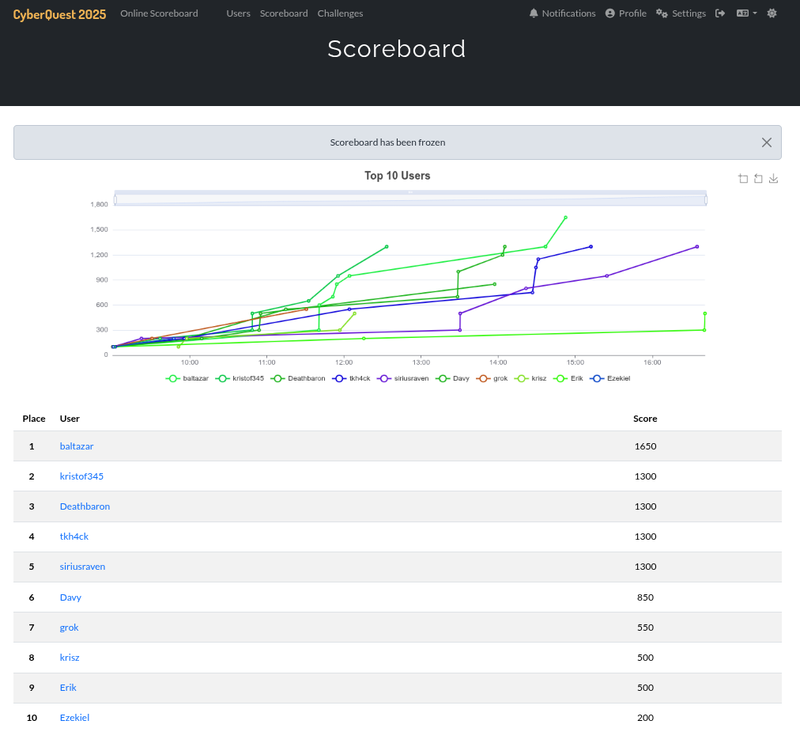
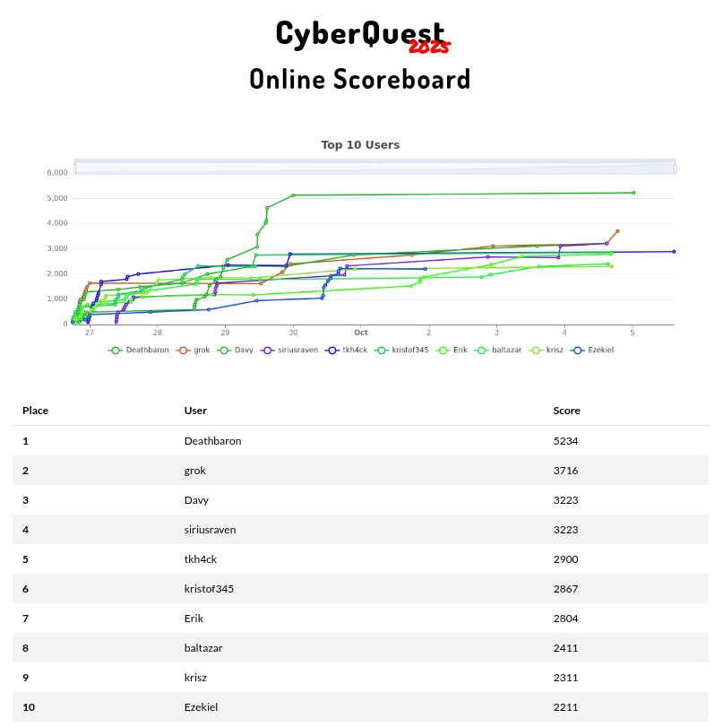

# CyberQuest 2025

In September and October *CyberQuest 2025* was organized in two rounds:
- The online / qualification round was between 26 September 2025 and 5 October 2025
- The offline / final round was on 17 October 2025 at Bosch Budapest Innovation Campus, Budapest

The organiser is one of the teams of Óbuda University, John von Neumann Faculty of Informatics, called HoneyLab. The team is supported and cooperates with the research lab of NIK-SOC.
- <https://honeylab.hu/>
- <https://soc.uni-obuda.hu/>

The official website of CyberQuest is: <https://cyberquest.honeylab.hu/>

Some statistics about the competition:
- 11 + 7 categories (quals + finals)
- 25 + 12 challenges (quals + finals)
- around 150 registered competitiors
- the top 10 was invited to the finals

**During the quals, I achieved the 5th place. In the finals, I was able to reach the 4th place.** It was a tight competition, the 2nd and the 5th place had the same scores, the 1st player (`baltazar`) was able to solve one more challenge. My initial goal was to reach the top 5, because 2 years ago I "only" reached the 6th place. Congratulations to all other competitiors, especially the top 3 (`baltazar`, `kristof345`, `Deathbaron`). And of course, many thanks to the Organizers!

In my opinion, the competition was not that hard, many challenges required more guessing or luck than knowledge or thinking, but I'm aware of the unfortunate problem that there are only a few challenge creators. My favourite challenges were the IoT challenges in the finals, which was created by `zh4ck` and `MJ` from [CUJO AI](https://cujo.com/).

## Finals

- [automotive](finals/Automotive)
    - [Cluster](finals/Automotive/Cluster/)
- [iot](finals/IoT)
    - [Matterware Detective](finals/IoT/Matterware-Detective/)
    - [Mission Comission 1](finals/IoT/Mission-Comission-1/)
    - [Ouija Board](finals/IoT/Ouija-Board/)
    - [Switch Happens](finals/IoT/Switch-Happens/)
- [misc](finals/Misc)
    - [Deathtrap](finals/Misc/Deathtrap/)
    - [Pinball](finals/Misc/Pinball/)
- [network](finals/Network)
    - [Fragments and Gateways](finals/Network/Fragments-and-Gateways/)
- [osint](finals/Osint)
    - [Where in the world is Tony California 3](finals/Osint/Where-in-the-world-is-Tony-California-3/)
- [pwn](finals/Pwn)
    - [Babyfpwn](finals/Pwn/Babyfpwn/)
- [welcome](finals/Welcome)
    - [VPN Guide](finals/Welcome/VPN-Guide/)
    - [Welcome](finals/Welcome/Welcome/)

## Quals

- [automotive](quals/Automotive)
    - [CANU Escape 1](quals/Automotive/CANU-Escape-1/)
    - [CANU Escape 2](quals/Automotive/CANU-Escape-2/)
    - [ChassisNumber](quals/Automotive/ChassisNumber/)
    - [Drivetrain](quals/Automotive/Drivetrain/)
- [crypto](quals/Crypto)
    - [Ecnef-liar](quals/Crypto/Ecnef-liar/)
    - [Pixelated](quals/Crypto/Pixelated/)
- [misc](quals/Misc)
    - [Investing Tips](quals/Misc/Investing-Tips/)
- [network](quals/Network)
    - [Secret Packets](quals/Network/Secret-Packets/)
- [osint](quals/OSINT)
    - [Cinder Repo Ghost](quals/OSINT/Cinder-Repo-Ghost/)
    - [Glass Ink](quals/OSINT/Glass-Ink/)
    - [Paprika Rally](quals/OSINT/Paprika-Rally/)
    - [Where in the world is Tony California 2](quals/OSINT/Where-in-the-world-is-Tony-California-2/)
- [privesc](quals/PrivEsc)
    - [Apatchy](quals/PrivEsc/Apatchy/)
- [pwn](quals/Pwn)
    - [RPS](quals/Pwn/RPS/)
- [reverse](quals/Reverse)
    - [Pokerod](quals/Reverse/Pokerod/)
- [steganography](quals/Steganography)
    - [Billboard2](quals/Steganography/Billboard2/)
    - [Creepy](quals/Steganography/Creepy/)
- [web](quals/Web)
    - [AuthoCalypse](quals/Web/AuthoCalypse/)
    - [Botanical](quals/Web/Botanical/)
    - [Mikroblog](quals/Web/Mikroblog/)
    - [Untyped](quals/Web/Untyped/)
- [welcome](quals/Welcome)
    - [Feedback](quals/Welcome/Feedback/)
    - [VPN Guide](quals/Welcome/VPN-Guide/)
    - [Welcome](quals/Welcome/welcome/)

Other write-ups: 
- `Deathbaron`: <https://github.com/mullerdavid/ctf_writeups/tree/master/cyberquest25>