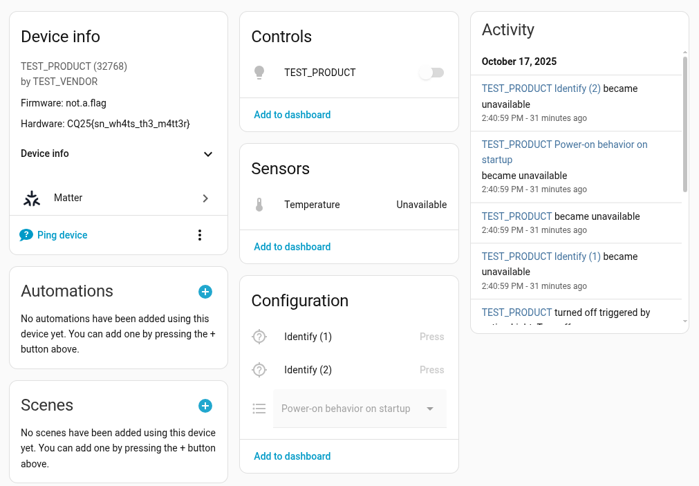

# CyberQuest 2025 - Final - Matterware Detective

## Description

# Matterware Detective

You, seeker among the countless worlds, should already feel this truth in your heart. For only by knowing a thing’s true name may one’s spirit reach out and touch its essence.

What is the hardware version string that the device advertises?

> Remarks from the authors:
> * You will need the provided hardware.
> * Start with the "Mission: Comission #2" challenge first.
> * Device needs to be USB powered. There is no battery. You should see some e-ink flashes.
> * The device is already on the Wi-Fi network, there is no need for special Bluetooth LE equipment.
> * If a pairing/commissioning fails for whatever reason, it is recommended to restart the device before the next try. Click the small RST button shortly on the device.

Challenge difficulty: `medium`

*Proudly sponsored by CUJO AI*

## Metadata

- Filename: -
- Tags: `iot`, `matter`

## Solution

On the `homeassistant` webserver, after commissioning the device, there is a page where we can query information about the device.

Flag: `CQ25{sn_wh4ts_th3_m4tt3r}`
