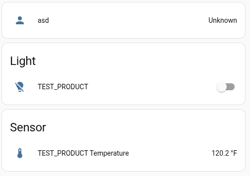

# CyberQuest 2025 - Final - Switch Happens

## Description

# Switch Happens

Whoa there. Too bright. Give me my dark mode back!

> Remarks from the authors:
> * You will need the provided hardware.
> * Start with the "Mission: Comission #2" challenge first.
> * Device needs to be USB powered. There is no battery. You should see some e-ink flashes.
> * The device is already on the Wi-Fi network, there is no need for special Bluetooth LE equipment.
> * If a pairing/commissioning fails for whatever reason, it is recommended to restart the device before the next try. Click the small RST button shortly on the device.

Challenge difficulty: `easy`

*Proudly sponsored by CUJO AI*

## Metadata

- Filename: -
- Tags: `iot`, `matter`

## Solution

On the `homeassistant` webserver, after commissioning the device, we can see that it is a smart switch and we can control the switch (turn it on or turn in off).

If we turn it off, the device displays the flag.

Flag: `CQ25{m4tt3r_0f_l1ght_sw1tch}`