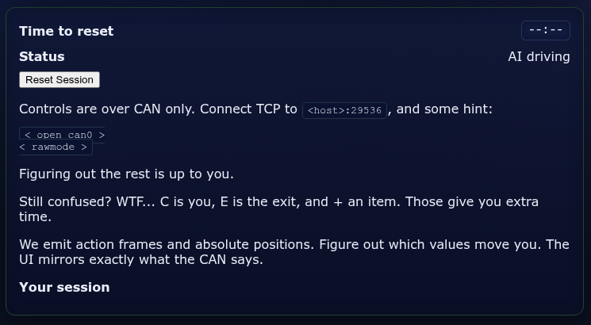

# CyberQuest 2025 - CANU Escape #1

## Description

*Brr brr, patapim. Car goes down to Anakin.* - I mean what a silly challenge description. Totally unrelated and just making fun that brr brr is what the car makes. *sighs MJ*.

MJ: yeah, you are right. So then here is this challenge. I'm gonna put your automotive skillz to test. This one is easy. Just find the flag!

> Remarks from the author:
> * the challenge requires no brute-forcing
> * VPN connection is required
> * the challenge runs on two ports

**Flag format**: `CQ25{...}`

Challenge difficulty: `easy`

*By MJ - Contact me on Discord with the same nick if you think you found an issue or open a ticket in #help-tickets.*

```
cq25-challenge0[1-9]-c.cq.honeylab:8080
cq25-challenge0[1-9]-c.cq.honeylab:29536
```

## Metadata

- Filename: -
- Tags: `can`

## Solution

From the website, we can get some information about the connection:



Give this information we can derive that it is [socketcand](https://github.com/linux-can/socketcand)

If we connect to port `29536` with `netcat` we get the following messages: 

```
< hi >
< frame 457 1758935672.377465 00030002 >
< frame 456 1758935672.377468 13 >
< frame 457 1758935673.377208 00030001 >
< frame 456 1758935673.377211 12 >
< frame 7e0 1758935673.880590 435132357B6D795F >
< frame 7e0 1758935673.880592 6361725F69735F47 >
< frame 7e0 1758935673.880593 4E552F4C696E7578 >
< frame 7e0 1758935673.880594 5F62617365647D >
< frame 457 1758935674.377331 00030002 >
< frame 456 1758935674.377334 13 >
< frame 457 1758935675.377259 00030003 >
< frame 456 1758935675.377261 13 >
< frame 7e0 1758935675.880399 435132357B6D795F >
< frame 7e0 1758935675.880403 6361725F69735F47 >
< frame 7e0 1758935675.880404 4E552F4C696E7578 >
< frame 7e0 1758935675.880404 5F62617365647D >
< frame 457 1758935676.376902 00030002 >
< frame 456 1758935676.376905 12 >
< frame 457 1758935677.377568 00030003 >
< frame 456 1758935677.377571 13 >
< frame 7e0 1758935677.880153 435132357B6D795F >
< frame 7e0 1758935677.880155 6361725F69735F47 >
< frame 7e0 1758935677.880156 4E552F4C696E7578 >
< frame 7e0 1758935677.880157 5F62617365647D >
< frame 457 1758935678.377264 00030002 >
< frame 456 1758935678.377393 12 >
< frame 457 1758935679.377090 00030001 >
< frame 456 1758935679.377094 12 >
< frame 7e0 1758935679.879532 435132357B6D795F >
< frame 7e0 1758935679.879534 6361725F69735F47 >
< frame 7e0 1758935679.879536 4E552F4C696E7578 >
< frame 7e0 1758935679.879537 5F62617365647D >
< frame 457 1758935680.377042 00040001 >
< frame 456 1758935680.377045 11 >
< frame 457 1758935681.377027 00030001 >
< frame 456 1758935681.377030 10 >
```

The first flag is hidden in the `7e0` messages:

```
< frame 7e0 1758935679.879532 435132357B6D795F >
< frame 7e0 1758935679.879534 6361725F69735F47 >
< frame 7e0 1758935679.879536 4E552F4C696E7578 >
< frame 7e0 1758935679.879537 5F62617365647D >
```

Flag: `CQ25{my_car_is_GNU/Linux_based}`