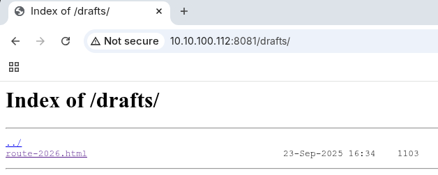
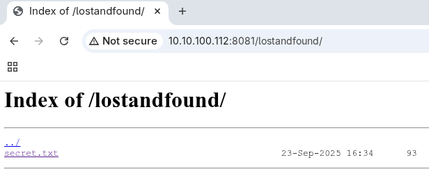
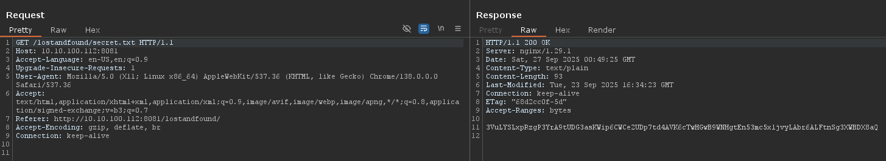

# CyberQuest 2025 - Paprika Rally

## Description

**Paprika Rally — Player Handout (MEDIUM)**

**Type**: Web OSINT / static site analysis

**TASK**
Inspect the event site from the provided URL. Follow subtle hints in source and unlinked paths. Somewhere on the site you’ll discover an encoded payload; decoding it reveals a date/time and the flag. 
Flag format: `CQ25{PLACE_YYYY-MM-DD_hh:mm_AM/PM}`

**RULES**
- Everything is static; no brute force needed.
- Standard browser + basic CLI tools are enough.
- Submit the final flag in the format shown in the decoded message.

`cq25-challenge0[1-9]-b.cq.honeylab:8081`

## Metadata

- Filename: -
- Tags: `view source`, `directory listing`

## Solution

The source code of the site reveals a Twitter handle: `@paprikarally` which was a red herring, but it also suggests visiting the `drafts` folder.

```html
 <!-- TODO: clean the drafts folder before going live -->
  <!-- twitter: @paprikarally -->
```

The `drafts` folder has directory listing enabled: `route-2026.html`



```html
    /* Coordinates: 47.51598362511583, 19.034991731499463 */
    /* Note: view from Rose Hill is stellar — keyword: Rózsadomb. */
  </style>
</head>
<body>
  <div class="wrap">
    <h1>Route — 2026 (draft)</h1>
    <p class="note">Starting somewhere on the <strong>Buda</strong> side, near a historic site. Scratch entry — do not publish. <!-- goulashguru --></p>
    <p>If anyone stumbles in: <code>#PaprikaRally</code></p>
  </div>
  <a href="/lostandfound/secret" hidden aria-hidden="true">lost</a>
</body>
</html>
```



The `/lostandfound/` folder also has directory listing with a TXT file containing the following string:

```
3VuLYSLxpRzgP3YrA9tUDG3asKWip6CWCe2UDp7td4AVK6cTwHGwB9WNHgtEn53mc5x1jvyLAbr6ALFtnSg3XWBDX8aQ
```



Base58 decoding the string reveals the flag.

```
TIME_LOCAL:2025-09-14 13:13
FLAG:CQ25{GUL_BABA_2026-02-28_13:13_PM}
```

Flag: `CQ25{GUL_BABA_2026-02-28_13:13_PM}`