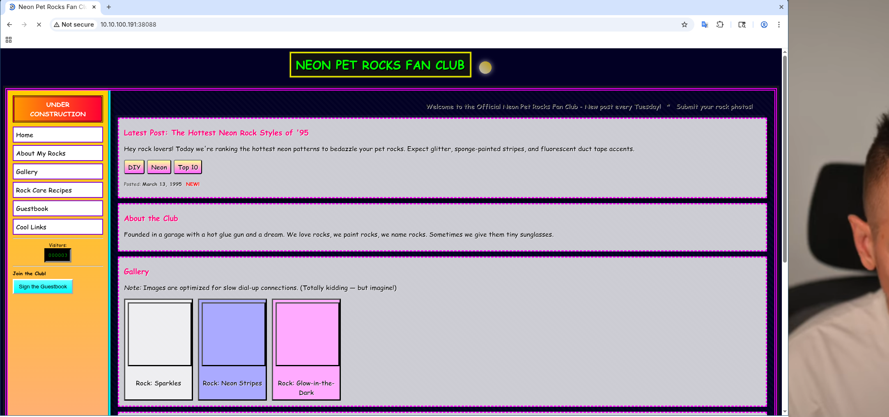
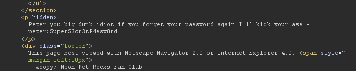

# CyberQuest 2025 - Apatchy

## Description

### Apatchy

Hey, I just got AOL dial up internet at my house, saw everyone was making these cool websites. Soooo I made mine about my favourite thing, glowing pet rocks. :D
Apache is so easy, I just hope people won't screw it up.

#### Creators comments:

> * Brute forcing is not required in this challenge
> * VPN connection is required

**Flag format**: `CQ25{flag}`

*By incarrnati0n*

```
cq25-challenge0[1-9]-a.cq.honeylab:27622
cq25-challenge0[1-9]-a.cq.honeylab:38088
```

## Metadata

- Filename: -
- Tags: `view source`, `hidden`, `ssh`, `sudo`

## Solution

On port `27622` there is an OpenSSH server, on port `38088` there is an Apache webserver:

```
PORT      STATE SERVICE VERSION
27622/tcp open  ssh     OpenSSH 9.6p1 Ubuntu 3ubuntu13.14 (Ubuntu Linux; protocol 2.0)
38088/tcp open  http    Apache httpd 2.4.58 ((Ubuntu))
```



Inspecting the source code of the site reveals a `hidden` `<p>` tag with some credentials:

```
<p hidden>Peter you big dumb idiot if you forget your password again I'll kick your ass - peter:SuperS3cr3tP4ssw0rd</p>
```



Let's try to log in the the credentials (`peter:SuperS3cr3tP4ssw0rd`) and use `sudo` to `cat` the flag from `/root/flag.txt`.

Flag: `CQ25{Who's_idea_was_this}`