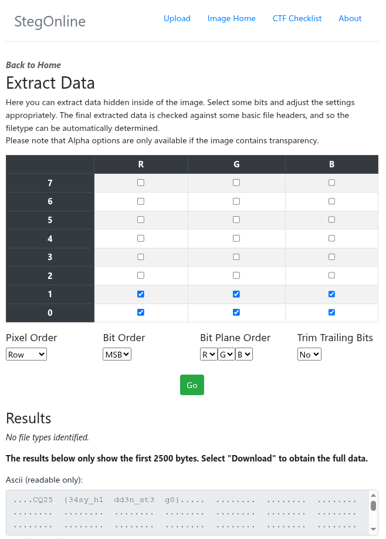

# CyberQuest 2025 - Billboard2

## Description

An unknown user folder mysteriously appeared in a home directory. The full contents of the home directory were turned over to our IT team for inspection.

They said the following, "It’s just a common image—nothing to see here."

But… are you sure they checked carefully?

Challenge difficulity: `easy`

## Metadata

- Filename: [`image.bmp`](files/image.bmp)
- Tags: `lsb`, `steganography`, `zsteg`, `stegonline`

## Solution

Extract the 2 LSB bits from the RGB values was the solution.

It can be done with `StegOnline`:

<https://georgeom.net/StegOnline/extract>

Flag: `CQ25{34sy_h1dd3n_st3g0}`