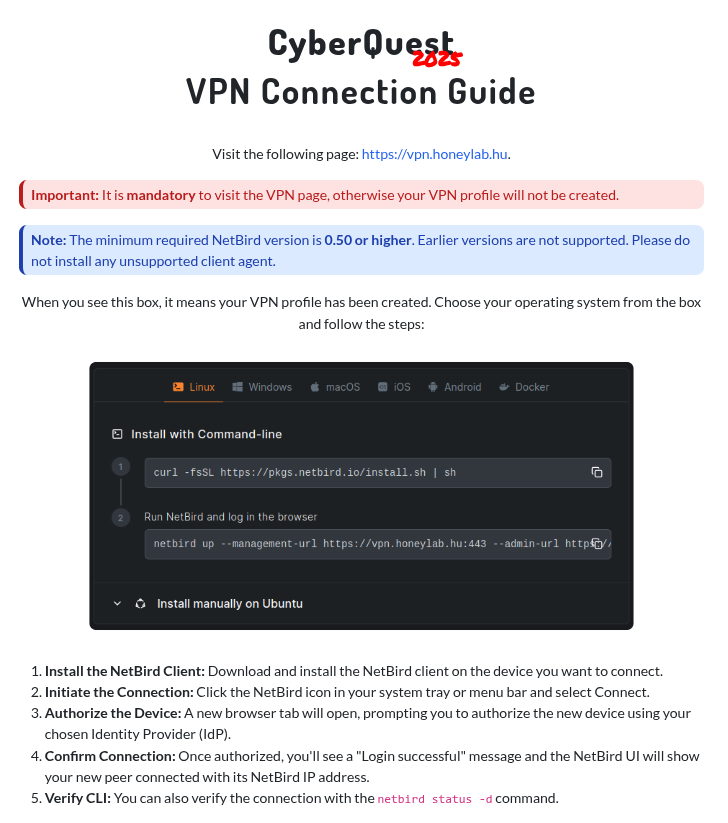

# CyberQuest 2025 - VPN Guide

## Description

### Welcome to the CyberQuest 2025 competition!

**Prepare yourself for the challenges ahead!**

This task won’t be difficult. Just follow the instructions:

1. Visit the **[/vpn](https://cyberquest.honeylab.hu/vpn)** page.
2. Join to our challange environment, with VPN. Follow the instruction.
3. Find the text in the subpage.
4. Submit the text in the field below.

That’s it! If you succeed, you can move on to the next one.

**Good luck!**

If you have any problem, please contact with us via ticket: <https://discord.honeylab.hu>

## Metadata

- Filename: -
- Tags: `netbird`, `vpn`

## Solution

For the VPN setup `netbird` was used which worked pretty well on my setup.

The setup instructions were the following, after the connection, we had to visit a site accessible through the VPN to get the flag.

Flag: `CQ25{c0mmun1cat10n_ch3ck}`