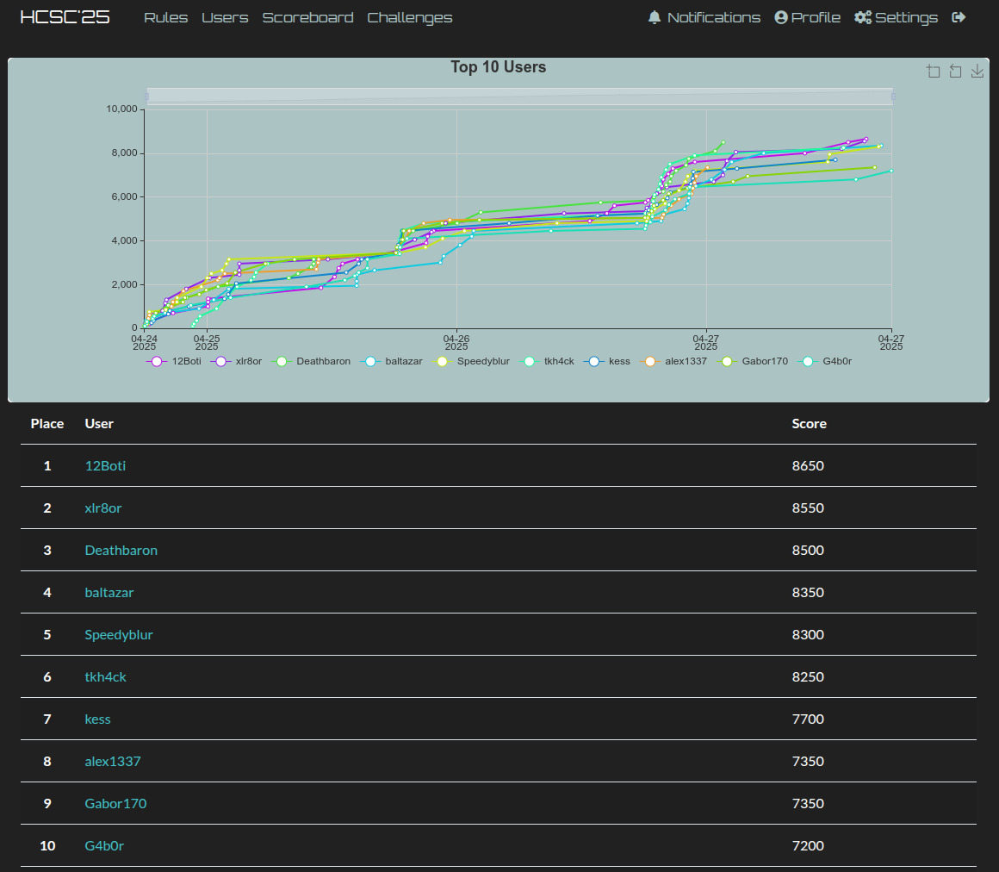

# Hungarian Cyber Security Challenge 2025 (HCSC'25)

Between 24th of April and 27th of April the 8th *Hungarian Cyber Security Challenge (HCSC)* was organized. The competition is organized by *Special Service for National Security National Cyber-Security Center (NKI)*, the challenges were created by *HoneyLab of University of Obuda* and *White Hat IT Security*.

The official website of HCSC is: <https://nki.gov.hu/en/rendezvenyek/hcsc/>

The challenges were available at: <https://ctfd.nki.gov.hu/>

Some statistics about the competition:
- 11 categories
- 36 challenges
- 417 registered competitiors
- 72 hours of hacking
- 229 competitors submitted at least 1 flag

I achieved the 6th place. To get the final picture, this year's HCSC was a very tight competition, there was only a one challenge gap between the 1st and the 6th place, so I was really close, but really fat. I'm not satisfied, I could not solve 4 challenge, 2 of the were very close and I also mismanaged my time and sleeping schedule. Next time! Congratulations to all other competitiors, especially the winners of each category. And of course, many thanks to the Organizers!

Normal challenges:

- [crypto](crypto)
    - [Eccentric](crypto/Eccentric/)
    - [Liberty Statue](crypto/Liberty-Statue/)
- [forensics](forensics)
    - [Nice Job](forensics/Nice-Job/)
- [misc](misc)
    - [Amazeing Blockchain](misc/Amazeing-Blockchain/)
    - [Binge Watch](misc/Binge-Watch/)
    - [Interlog](misc/Interlog/)
    - [Mystery Model](misc/Mystery-Model/)
- [mobile](mobile)
    - [Infometer](mobile/Infometer/)
- [network](network)
    - [Capture me if you can](network/Capture-me-if-you-can/)
    - [Naked Bytes](network/Naked-Bytes/)
    - [The Silent Terminal](network/The-Silent-Terminal/)
- [osint](osint)
    - [Find my mom](osint/Find-my-mon/)
    - [Hidden Clues](osint/Hidden-Clues/)
- [pentest](pentest)
    - [Midnight Deployments](pentest/Midnight-Deployments/)
- [reverse](reverse)
    - [License lost](reverse/License-lost/)
    - [Voldemort](reverse/Voldemort/)
- [web](web)
    - [Archive](web/Archive/)
    - [The complaint department](web/The-complaint-department/)
- [welcome](welcome)
    - [welcome](welcome/welcome/)

Forensics VM (defense) challenges:

- [Forensics 1](defense/Forensic-1)
- [Forensics 2](defense/Forensic-2)
- [Forensics 3](defense/Forensic-3)
- [Forensics 4](defense/Forensic-4)
- [Forensics 5](defense/Forensic-5)
- [Forensics 6](defense/Forensic-6)
- [Forensics 7](defense/Forensic-7)
- [Forensics 8](defense/Forensic-8)
- [Forensics 9](defense/Forensic-9)
- [Forensics 10](defense/Forensic-10)
- [Forensics 11](defense/Forensic-11)
- [Forensics 12](defense/Forensic-12)

Other write-ups: 
- `Deathbaron`: <https://github.com/mullerdavid/ctf_writeups/tree/master/hcsc25>