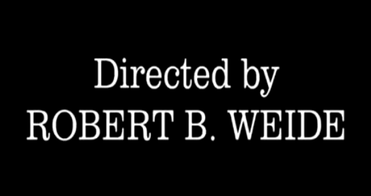
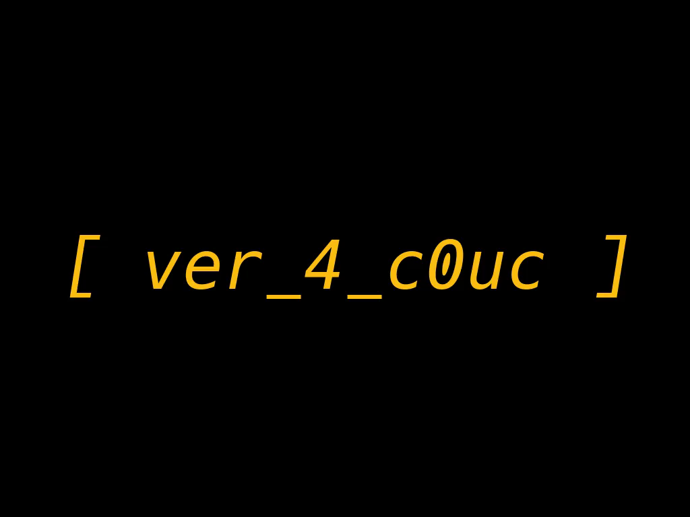
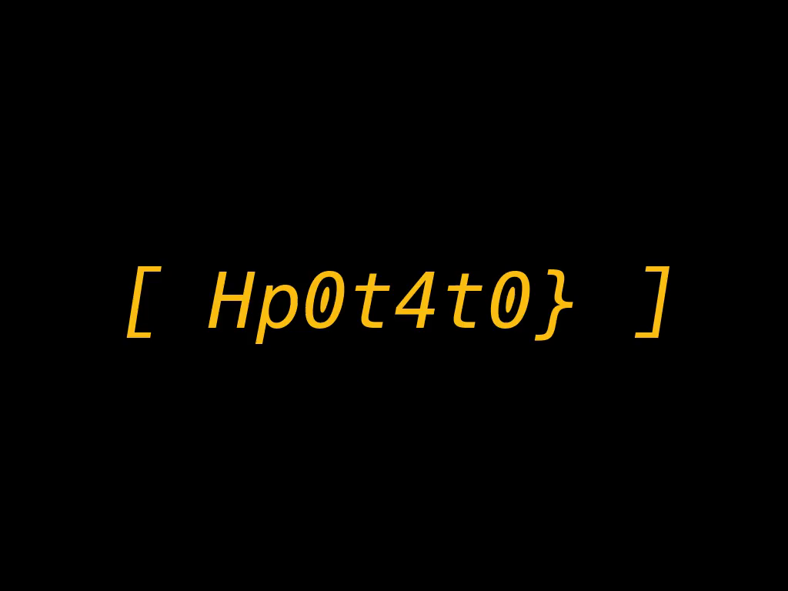

# HCSC 2025 - Binge Watch

## Description

CTF competitions can often be tiresome... I know that feeling very well. Which is exactly why I went along and prepared a nice long selfmade movie for you. Hope you got some popcorn prepared. All you need to do is sit back and relax.

Look out for `/stream.mpd`.

Remarks from the creator:
* VPN connection is required
* you do not need to pirate to solve this
* flag is in parts

**Flag format**: `HCSC{...}`

`10.10.1-9.11`

*By MJ*

## Metadata

- Filename: -
- Tags: `drm`, `mp4`, `widevine`, `bento4`, `shaka packager`, `ffmpeg`
- Points: 350
- Number of solvers: 6

## Solution

If we download `stream.mpd` we can deduce that it describes a `Widevine` protected `mp4` media which is around 3 hours long.

```xml
<?xml version="1.0" ?>
<MPD xmlns:cenc="urn:mpeg:cenc:2013" xmlns="urn:mpeg:dash:schema:mpd:2011" profiles="urn:mpeg:dash:profile:isoff-live:2011" minBufferTime="PT60.01S" mediaPresentationDuration="PT3H3M1.440S" type="static">
  <Period>
    <!-- Video -->
    <AdaptationSet mimeType="video/mp4" segmentAlignment="true" startWithSAP="1" maxWidth="1024" maxHeight="768">
      <!-- MPEG Common Encryption -->
      <ContentProtection schemeIdUri="urn:mpeg:dash:mp4protection:2011" value="cenc" cenc:default_KID="90351951-686b-5e1b-a222-439ecec1f12a"/>
      <!-- Widevine -->
      <ContentProtection schemeIdUri="urn:uuid:edef8ba9-79d6-4ace-a3c8-27dcd51d21ed"/>
      <SegmentTemplate timescale="1000" duration="60008" initialization="$RepresentationID$/init.mp4" media="$RepresentationID$/seg-$Number$.m4s" startNumber="1"/>
      <Representation id="video/avc1" codecs="avc1.64001F" width="1024" height="768" scanType="progressive" frameRate="25" bandwidth="15268"/>
    </AdaptationSet>
  </Period>
</MPD>
```

It is not possible to decrypt it without a license server or the correct key.

If we look up how to work with `mp4` files and DRM media we'll eventually find `Bento4 SDK` (<https://github.com/axiomatic-systems/Bento4>).

They have a documentation and a how-to / know-how about DRM: <https://www.bento4.com/developers/dash/encryption_and_drm/>

> With a KID = 90351951686b5e1ba222439ecec1f12a, an encryption KEY = 0a237b0752cbf1a827e2fecfb87479a2, a Widevine Service Provider ID = widevine_test, and a content ID = * (2a in hexadecimal), you would package a single video file video-source.mp4 using a command line like:

```bash
mp4dash --widevine-header provider:widevine_test#content_id:2a --encryption-key 90351951686b5e1ba222439ecec1f12a:0a237b0752cbf1a827e2fecfb87479a2 video-source.mp4
```

If we look closely, the `KID` is the same as in our `.mpd` file so the actual key must be the same too:

```
90351951686b5e1ba222439ecec1f12a:0a237b0752cbf1a827e2fecfb87479a2
```

Now we just have to decrypt the file.

We can download the `/video/avc1/init.mp4` and `/video/avc1/seg-$Number$.m4s` files and merge them to prepare the decryption.

```bash
$ cat init.mp4 $(ls seg-*.m4s | sort -V) > encrypted-full.mp4
```

The *Shaka Packager* (<https://github.com/shaka-project/shaka-packager>) can be used to decrypt DRM protected media, according to the documentation: <https://shaka-project.github.io/shaka-packager/html/documentation.html#encryption-decryption-options>

```bash
$ ./packager-linux-x64 input=encrypted-full.mp4,stream=video,output=decrypted-full.mp4 --enable_raw_key_decryption --keys key_id=90351951686b5e1ba222439ecec1f12a:key=0a237b0752cbf1a827e2fecfb87479a2
```

We have a decrypted 3 hours long mp4 file, it is mostly black, but at the end there is this:



This means that the decryption was successful, so I extracted all the frames from the video and compared their size, there were a few odd ones out.

```bash
$ ffmpeg -i decrypted-full.mp4 -vsync 0 frames/frame_%05d.png
```






The flag is: `HCSC{f0rever_4_c0ucHp0t4t0}`

The following `ffmpeg` command could also be used for decryption.

```bash
ffmpeg -cenc_decryption_key 0a237b0752cbf1a827e2fecfb87479a2 -i http://10.10.1.11:35721/stream.mpd -c copy decrypted.mp4
```