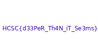

# HCSC 2025 - Infometer

## Description

Welcome to Infometer - the app that claims to measure the reliability of information. Because who doesn’t love trusting an app with their deepest thoughts? But hey, maybe it’s more than just an overconfident calculator. Some say it can be used to find the truth... or at least something pretending to be it.

```
SHA256: 6baf2dec3337ca85f5fa25caa30de451f3be87586b1272efa9f99170c83f0809
```

Flag format: `HCSC{...}`

*By: ab310*

## Metadata

- Filename: [`Infometer.apk`](files/Infometer.apk)
- Tags: `android`, `frida`, `fragments`, `navigation`
- Points: 350
- Number of solvers: 43

## Solution

We got a basic application, which has one input and based on the input it calculates the *reliability score*.

To solve the challenge I used an `emulator`, `frida` and `jadx-gui`.

In the `res/navigation/mobile_navigation.xml` file we can see that there is an interesting fragment which is never referred (never used from another fragment as a destination): `hu.hcsc.infometer.ui.truth.UltimateTruth`

```xml
<?xml version="1.0" encoding="utf-8"?>
<navigation xmlns:android="http://schemas.android.com/apk/res/android" xmlns:app="http://schemas.android.com/apk/res-auto"
    android:id="@+id/mobile_navigation"
    app:startDestination="@+id/navigation_home">
    <fragment
        android:label="@string/title_home"
        android:name="hu.hcsc.infometer.ui.home.HomeFragment"
        android:id="@+id/navigation_home">
        <action
            android:id="@+id/toFirst"
            app:destination="@+id/navigation_result">
            <argument
                android:name="information"
                app:argType="string"/>
        </action>
    </fragment>
    <fragment
        android:label="@string/truth"
        android:name="hu.hcsc.infometer.ui.truth.UltimateTruth"
        android:id="@+id/navigation_truth"/>
    <fragment
        android:label="@string/result"
        android:name="hu.hcsc.infometer.ui.calc.Result"
        android:id="@+id/navigation_result">
        <argument
            android:name="information"
            android:defaultValue=""
            app:argType="string"/>
        <action
            android:id="@+id/buttonToHome"
            app:destination="@+id/navigation_home"/>
    </fragment>
</navigation>
```

The `hu.hcsc.infometer.ui.truth.UltimateTruth` class basically reads an encrypted, encoded bytestream from the resources (`encrypted_data.txt`), it gets and AES key from a native library (`native-lib`), decrypts the data, uses another hardcoded key to XOR the data. The result is a bitmap, which is displayed on the screen.

```java
public final class UltimateTruth extends Fragment {
    private final String f1268a = "th15_1s_n0t_a_r3v_t45k";
    public UltimateTruth() {
        System.loadLibrary("native-lib");
    }
    private final Bitmap b(Context context) {
        try {
            byte[] e = e(context);
            byte[] g = g();
            SecretKeySpec secretKeySpec = new SecretKeySpec(g, "AES");
            IvParameterSpec ivParameterSpec = new IvParameterSpec(g);
            Cipher cipher = Cipher.getInstance("AES/CBC/PKCS5Padding");
            cipher.init(2, secretKeySpec, ivParameterSpec);
            byte[] doFinal = cipher.doFinal(e);
            Intrinsics.b(doFinal);
            return BitmapFactory.decodeStream(new ByteArrayInputStream(i(h(doFinal), this.f1268a)));
        } catch (Exception unused) {
            return null;
        }
    }

    private final byte[] e(Context context) {
        InputStream open = context.getAssets().open("encrypted_data.txt");
        Intrinsics.d(open, "open(...)");
        Reader inputStreamReader = new InputStreamReader(open, Charsets.f1305a);
        BufferedReader bufferedReader = inputStreamReader instanceof BufferedReader ? (BufferedReader) inputStreamReader : new BufferedReader(inputStreamReader, 8192);
        try {
            StringWriter stringWriter = new StringWriter();
            char[] cArr = new char[8192];
            while (true) {
                int read = bufferedReader.read(cArr);
                if (read < 0) {
                    String stringWriter2 = stringWriter.toString();
                    Intrinsics.d(stringWriter2, "buffer.toString()");
                    CloseableKt.a(bufferedReader, null);
                    byte[] decode = Base64.decode(stringWriter2, 0);
                    Intrinsics.b(decode);
                    return decode;
                }
                stringWriter.write(cArr, 0, read);
            }
        } finally {
        }
    }

    private final byte[] g() {
        try {
            return j(getNativeKey());
        } catch (Exception unused) {
            return new byte[16];
        }
    }

    private final byte[] h(byte[] bArr) {
        Intrinsics.e(bArr, "<this>");
        if (bArr.length == 0) {
            throw new NoSuchElementException("Array is empty.");
        }
        byte b = bArr[bArr.length - 1];
        return 1 <= b && b < 17 ? ArraysKt.i(bArr, bArr.length - b) : bArr;
    }

    private final byte[] i(byte[] bArr, String str) {
        byte[] bytes = str.getBytes(Charsets.f1305a);
        Intrinsics.d(bytes, "this as java.lang.String).getBytes(charset)");
        byte[] bArr2 = new byte[bArr.length];
        int length = bArr.length;
        for (int i = 0; i < length; i++) {
            bArr2[i] = (byte) (bArr[i] ^ bytes[i % bytes.length]);
        }
        return bArr2;
    }

    private final byte[] j(String str) {
        int length = str.length() / 2;
        byte[] bArr = new byte[length];
        for (int i = 0; i < length; i++) {
            int i2 = i * 2;
            String substring = str.substring(i2, i2 + 2);
            Intrinsics.d(substring, "this as java.lang.String…ing(startIndex, endIndex)");
            CharsKt.c(16);
            bArr[i] = (byte) Integer.parseInt(substring, 16);
        }
        return bArr;
    }

    @NotNull
    public final native String getNativeKey();

    @Override // androidx.fragment.app.Fragment
    @Nullable
    public View onCreateView(@NotNull LayoutInflater inflater, @Nullable ViewGroup viewGroup, @Nullable Bundle bundle) {
        Intrinsics.e(inflater, "inflater");
        View inflate = inflater.inflate(R.layout.fragment_truth, (ViewGroup) null);
        ImageView imageView = (ImageView) inflate.findViewById(R.id.imageView);
        Context requireContext = requireContext();
        Intrinsics.d(requireContext, "requireContext(...)");
        imageView.setImageBitmap(b(requireContext));
        return inflate;
    }
}
```

I tried to somehow open this fragment with `frida` like when the application wants to open the `result` fragment, I changed it to open the `Truth` fragment, but it did not work.

So I wrote the following `frida` script to create and object from the `UltimateTruth` class, call the necessary functions and dump the decrypted byte stream.

```javascript
setTimeout(function() {
    Java.perform(function() { 
        var truthImpl = Java.use('hu.hcsc.infometer.ui.truth.UltimateTruth');
        var truthObj = truthImpl.$new();
        truthImpl.i.implementation = function (bArr, str) {
            var retval = this.i(bArr, str);
            console.log(retval);
            return retval;
        }
        var context = Java.use('android.app.ActivityThread').currentApplication().getApplicationContext();
        truthObj.b(context);
    });
}, 0);
```

I used python to write the result byte stream as a PNG file.

```python
import io
import PIL.Image as Image

original = [...]
corrected = []
for b in original:
    if b < 0:
        corrected.append(256+b)
    else:
        corrected.append(b)

image = Image.open(io.BytesIO(bytearray(corrected)))
image.save("flag.png")
```



The following post gave the idea for the challenge according to MJ: <https://swarm.ptsecurity.com/android-jetpack-navigation-deep-links-handling-exploitation/>

The flag is: `HCSC{d33PeR_Th4N_iT_Se3ms}`