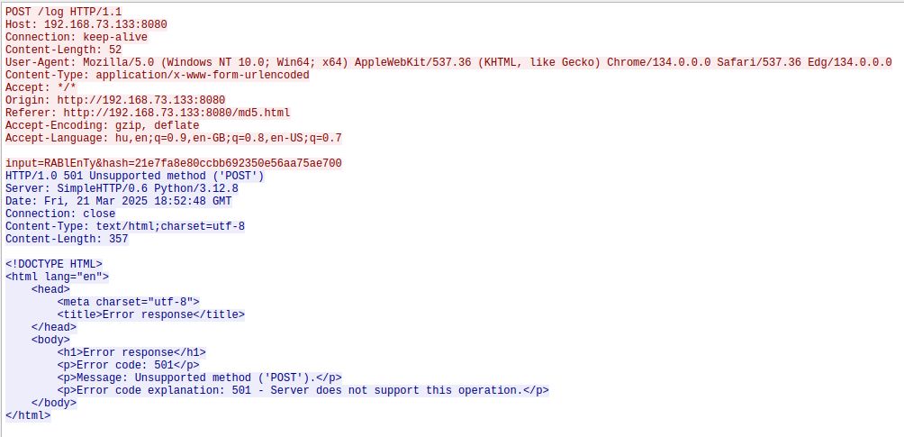

# HCSC 2025 - Naked Bytes

## Description

The network never forgets. Someone executes an operation, a thought leaves a trace, transforms, and then disappears. Everything seems to proceed as expected, but those who pay close attention may notice the subtle signs.

Password for the ZIP archive: `hcsc2025`
```
SHA1: 5597bc3bf44fcaf1cd57cc285d065f7e1bd36659
SHA256: 641f67694d1f8a57e179ad90333b2109c59c2675312332fbb1656546360447b0
```

## Metadata

- Filename: [`nakedbytes.zip`](files/nakedbytes.zip)
- Tags: `wireshark`, `ftp`, `zip`
- Points: 250
- Number of solvers: 65

## Solution

We got a network capture file.

Using the `File -> Export objects -> FTP` menu, we can save a password protected `secret.zip` file transferred through an FTP session.

Another interesting stream is stream 72:



```
POST /log HTTP/1.1
Host: 192.168.73.133:8080
Connection: keep-alive
Content-Length: 52
User-Agent: Mozilla/5.0 (Windows NT 10.0; Win64; x64) AppleWebKit/537.36 (KHTML, like Gecko) Chrome/134.0.0.0 Safari/537.36 Edg/134.0.0.0
Content-Type: application/x-www-form-urlencoded
Accept: */*
Origin: http://192.168.73.133:8080
Referer: http://192.168.73.133:8080/md5.html
Accept-Encoding: gzip, deflate
Accept-Language: hu,en;q=0.9,en-GB;q=0.8,en-US;q=0.7

input=RABlEnTy&hash=21e7fa8e80ccbb692350e56aa75ae700
HTTP/1.0 501 Unsupported method ('POST')
Server: SimpleHTTP/0.6 Python/3.12.8
Date: Fri, 21 Mar 2025 18:52:48 GMT
Connection: close
Content-Type: text/html;charset=utf-8
Content-Length: 357

<!DOCTYPE HTML>
<html lang="en">
    <head>
        <meta charset="utf-8">
        <title>Error response</title>
    </head>
    <body>
        <h1>Error response</h1>
        <p>Error code: 501</p>
        <p>Message: Unsupported method ('POST').</p>
        <p>Error code explanation: 501 - Server does not support this operation.</p>
    </body>
</html>
```

The HTTP communication has two interesting strings: `RABlEnTy`, `21e7fa8e80ccbb692350e56aa75ae700`

We can try to use them as a password, `21e7fa8e80ccbb692350e56aa75ae700` works

```
$ unzip secret.zip
Archive:  secret.zip
[secret.zip] flag.txt password:
password incorrect--reenter:
 extracting: flag.txt
$ cat flag.txt
HCSC{pAcK3t_C4pTuR3_rEvEaLs_4LL}
```

The flag is: `HCSC{pAcK3t_C4pTuR3_rEvEaLs_4LL}`