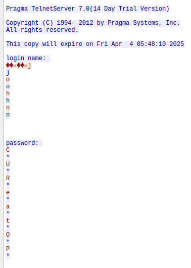

# HCSC 2025 - The Silent Terminal

## Description

Deep within an abandoned server network, a secret terminal lies hidden, accessible only to those who know the right key. However, amidst the signals flowing through the network, someone has carelessly left behind a small piece of information that could grant access. The secret the system tried to conceal is now out in the open for all to see, but only the observant ones will find it.

Password for the ZIP archive: `hcsc2025`

`10.10.1-9.12:9239`

```
SHA1: ad4bbf5e40af8bda394cd8ac8310899d844db1c7
SHA256: 60de2de13933d978cdc36137ee2f91589053856902250bbde8c887ed2e77e13d
```

## Metadata

- Filename: [`ctf-the_silent_terminal.zip`](files/ctf-the_silent_terminal.zip)
- Tags: `wireshark`, `telnet`
- Points: 100
- Number of solvers: 116

## Solution

We got a network capture file which we can open in Wireshark.

If we follow the TCP streams, `tcp.stream eq 32` will give us a `telnet` session where we can see the plaintext credentials: `john` / `CUReatOP`



Now we can use `nc` to access the service and get the flag.

```
$ nc 10.10.4.12 9239
Enter username: john
Enter password: CUReatOP
HCSC{Pl41n_T3xT_Tr4nSf3r_1s_R1sKy}
```

The flag is: `HCSC{Pl41n_T3xT_Tr4nSf3r_1s_R1sKy}`