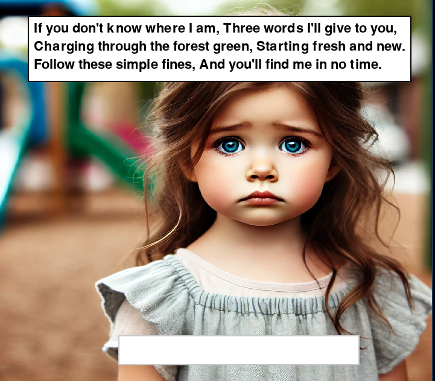
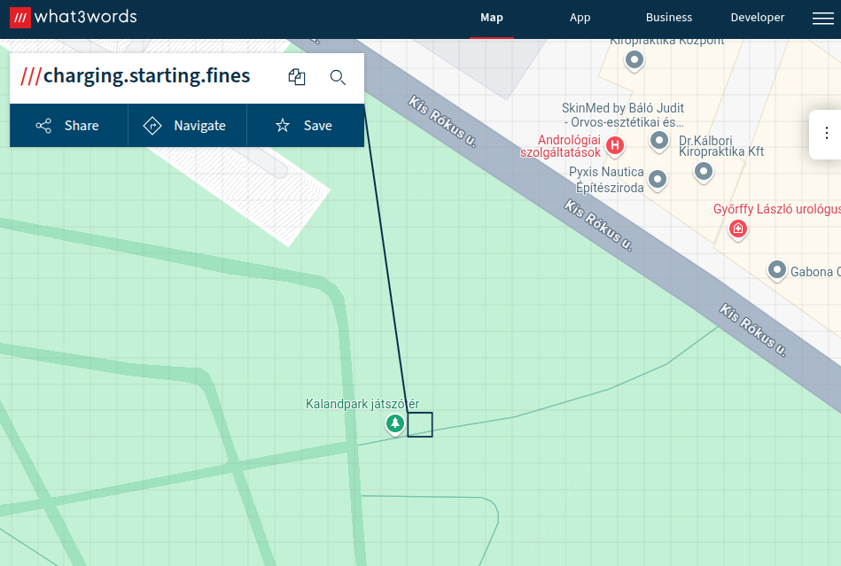
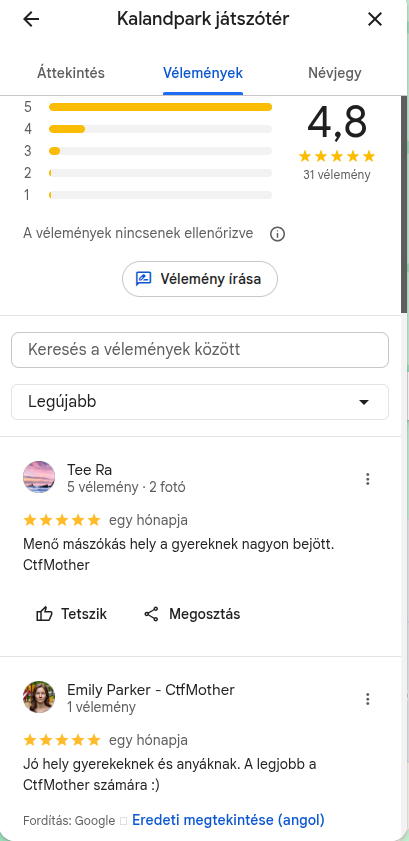
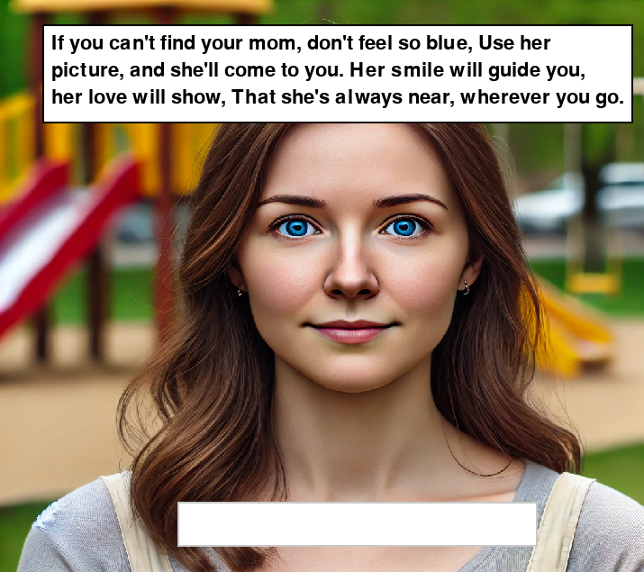
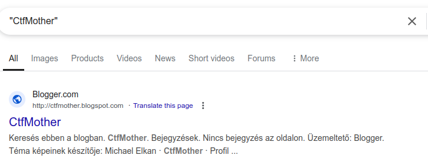
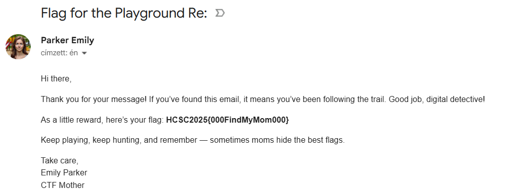

# HCSC 2025 - Find my mon

## Description

📘 Find My Mom – OSINT CTF Game Help

Welcome, Agent!

Your mission is to help Hanna find her mother. She got separated and only has a few clues to share with you. The game is a light OSINT challenge – you’ll need to investigate online using hints she gives you.

🧩 Gameplay Instructions:

1. The game starts with Hanna speaking to you.
2. Use the arrow buttons to navigate through her messages.
3. Once she gives you a riddle or clue, search online (Google may help 😉).
4. When you find the correct keyword or location, enter it into the input field.
5. If the answer is correct, the story will continue.

🔐 Hints:

- The first clue is related to a geolocation service.
- Use the poem lines carefully — they point toward a specific service that uses 3 words.
- Look up the poem phrase online to find the exact location or code.
- The answer format is case sensitive, no spaces.

🎯 Goal:

The game ends when you help Hanna find her mom. If you're successful, you'll see a final message — but the actual *flag* is something you need to deduce or gather from the full journey.

Flag format: HCSC25{...}

Good luck, detective. 🌐🔍

## Metadata

- Filename: [`FindMyMom1`](files/FindMyMom1)
- Tags: `what3words`, `reviews`, `google`, `email`
- Points: 150
- Number of solvers: 11

## Solution

For whatever reason I was not able to solve this challenge lol...

If we start the application (which is a `PyGame` application) we will get the following poem:



> If you don't know where I am, Three words I'll give to you,
Charging through the forest green, Starting fresh and new
Follow these simple fines, And you'll find me in no time

The hints and the poem suggest that we have to find a location on `what3words` (<https://what3words.com/during.vets.layered>) and we have to get the three words from the poem.

I guessed that the 3 words will come from the last 2 line, one from each part:
- *Charging through the forest green*
- *Starting fresh and new*
- *Follow these simple fines*

There are not so many combinations are the service does not accept all words:

```
charging, forest, green
starting, fresh
follow, these, simple, fines
```

The correct combination is: `charging.starting.fines`



It points to *Kalandpark játszótér* at *Millenáris park*.

If we look at the review of the place, we will find our answer: `CtfMother`



We get a second poem:



> If cou can't find your mom, don't feel so blue, Use her 
picture, and she'll come to you. Her smile will guide you, 
her love will show, That she's always near, wherever you go.

I tried looking up all social media profiles of *Emily Parker*, look up her image, search for `CtfMother` as a handle, but somehow I forgot to search for `"CtfMother"` with quotes in Google.



We will find the following page: <https://ctfmother.blogspot.com/>

Here we have the last clue: `CtfPlayground`

Furthermore, the page says what to do for the flag:

> If by any chance you ever come across Hanna in the future, please drop me an email at ctfmother@gmail.com — and use the title of this post to move forward.

So we should have just write an email to `ctfmother@gmail.com` and that's it.



The flag is: `HCSC2025{000FindMyMom000}`

-----

An alternative solution was to reverse engineer the binary.

We can use `pyinstxtractor` (<https://github.com/extremecoders-re/pyinstxtractor>) to extract the compiled Python codes and then use <https://pylingual.io/> to decompile the `FindMyMom1.pyc` file.

```python
    game_stage = 'start'
    SECRET_KEY = 'some_random_secret_key'
    CORRECT_HASH_1 = hashlib.sha256(('CtfMother' + SECRET_KEY).encode()).hexdigest()
    CORRECT_HASH_2 = hashlib.sha256(('CtfPlayground' + SECRET_KEY).encode()).hexdigest()
    input_text = ''
```

The answers are hardcoded in the binary.

Now we can search for `"CtfMother"` again and solve the challenge.