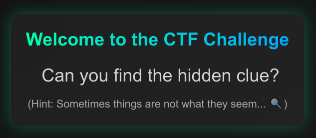
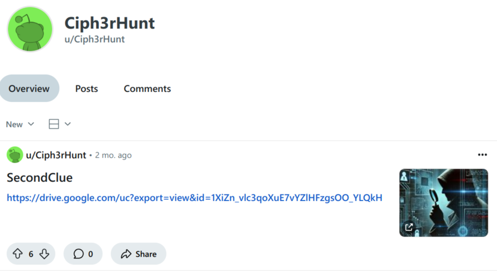

# HCSC 2025 - Hidden Clues

## Description

Sometimes, the most valuable clues are right in front of you – if you know where to look.

A string of characters is hidden within the content of the website. But what does it mean? Who does it belong to? If you ask the right questions, you’ll find the right answers.

Follow the clues, examine every detail, only the keenest eyes will notice them. But even then, the meaning may not be immediately clear sometimes – the real message is hidden deeper than you think.

Good luck!

Flag format: HCSC{. . . }

`10.10.1-9.12:7298`

## Metadata

- Filename: -
- Tags: `view source`, `reddit`, `exiftool`, `morse`
- Points: 200
- Number of solvers: 88

## Solution

If we view the source of the website, we can find the first clue:



```
[...]
<body>

    <div class="container">
        <span class="title">Welcome to the CTF Challenge</span>
        <span class="subtitle">Can you find the hidden clue?</span>
        <p class="hint">(Hint: Sometimes things are not what they seem... 🔍)</p>
        <div class="hidden">first clue: Q2lwaDNySHVudA== </div>
    </div>

</body>
</html>
```

The `Q2lwaDNySHVudA==` strings base64 decoded is `Ciph3rHunt`.

There is a `Ciph3rHunt` user onn Reddit: <https://www.reddit.com/user/Ciph3rHunt/>



The second clue is: <https://drive.google.com/uc?export=view&id=1XiZn_vlc3qoXuE7vYZlHFzgsOO_YLQkH>


If we run `exiftool` there is an interesting comment:

```bash
$ exiftool second-clue.jpg 
ExifTool Version Number         : 13.10
File Name                       : second-clue.jpg
Directory                       : .
File Size                       : 280 kB
File Modification Date/Time     : 2025:03:04 20:18:08+00:00
File Access Date/Time           : 2025:04:26 12:30:49+00:00
File Inode Change Date/Time     : 2025:04:24 21:19:18+00:00
File Permissions                : -rw-r--r--
File Type                       : JPEG
File Type Extension             : jpg
MIME Type                       : image/jpeg
JFIF Version                    : 1.01
Resolution Unit                 : None
X Resolution                    : 1
Y Resolution                    : 1
Comment                         : -- ----- .-. ... ...-- ..--.- -.. ...-- -.-. ----- -.. ...-- .-. ..--.- .-. ...-- ...- ...-- ....- .-.. ...-- -..
Image Width                     : 1024
Image Height                    : 1024
Encoding Process                : Baseline DCT, Huffman coding
Bits Per Sample                 : 8
Color Components                : 3
Y Cb Cr Sub Sampling            : YCbCr4:4:4 (1 1)
Image Size                      : 1024x1024
Megapixels                      : 1.0
```

If we use a morse decoder online (be careful, some decoders change `_` to `#`):

```
-- ----- .-. ... ...-- ..--.- -.. ...-- -.-. ----- -.. ...-- .-. ..--.- .-. ...-- ...- ...-- ....- .-.. ...-- -..
M0RS3_D3C0D3R_R3V34L3D
```

The flag is: `HCSC{M0RS3_D3C0D3R_R3V34L3D}`