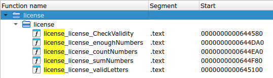
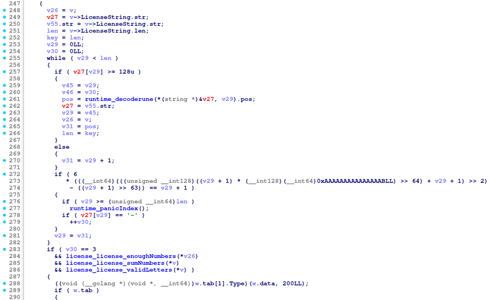
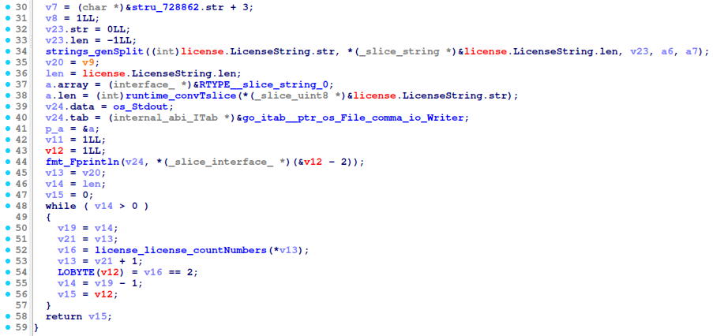
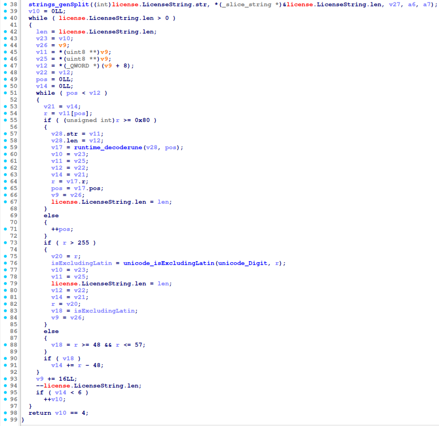
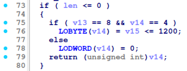
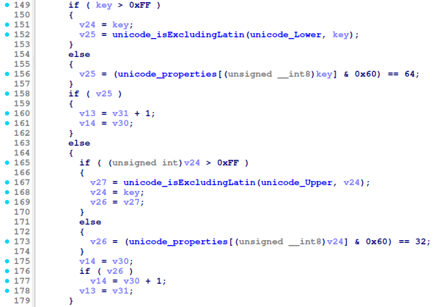
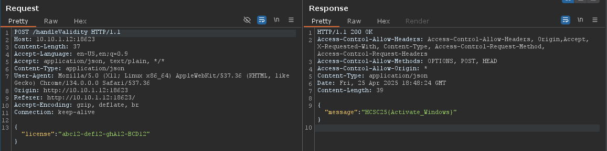

# HCSC 2025 - License lost

## Description

Has it ever happened to you that you were using your Gigantichard doors operating system and an annoying watermark appeared saying you have to activate it? Well, it just happened to me, can you help find a correct license with the help of this leaked binary? 

**Note**: The challenge is running on a web application

* VPN connection is required for this challenge
* Brute forcing is not required
* Use the given binary to solve the challenge
* Flag is case insensitive

**Flag format**: `HCSC25{<flag>}`

`10.10.1-9.12:18623`

*By incarrnati0n*

## Metadata

- Filename: [`binary.zip`](files/binary.zip)
- Tags: `go`, `license key`
- Points: 350
- Number of solvers: 17

## Solution

The given website can be used to validate a license. Our goal is to reverse engineer and understand the `go` application to identify what licenses are accepted.

If we decompile the binary with IDA and Ghidra, we will find that there are a few interesting function names:



```
license_license_CheckValidity - 0000000000644580
license_license_enoughNumbers - 0000000000644DA0
license_license_countNumbers - 0000000000644EA0
license_license_sumNumbers - 0000000000644F80
license_license_validLetters - 0000000000645100
```

The `CheckValidity` function handles our POST request with the license key in JSON.

The most interesting part of this function can be seen below:



It checks whether the license has 4 parts separated by a `-` character. Then it calls the `enoughNumbers`, `countNumbers` and `validLetters` functions, if they all return `true`, the license is valid.

**`enoughNumbers`**



**`countNumbers`**



**`validLetters`**





The following constraints can be deduced from the decompiled functions:
- (`CheckValidity`) the license has the following format: `xxxxx-xxxxx-xxxxx-xxxxx` where `x` can be an alnum character
- (`enoughNumbers`) there are 2 numbers in each segment
- (`countNumbers`) the sum of the number in each segment should be lower than 6
- (`validLetters`) there are 8 lower case characters
- (`validLetters`) there are 4 upper case characters
- (`validLetters`) the sum of the characters in the license key should be lower than 1200

The following license satisfies the conditions: `abc12-def12-ghA12-BCD12`

If we submit it, we get the flag.



The flag is: `HCSC25{Activate_Windows}`